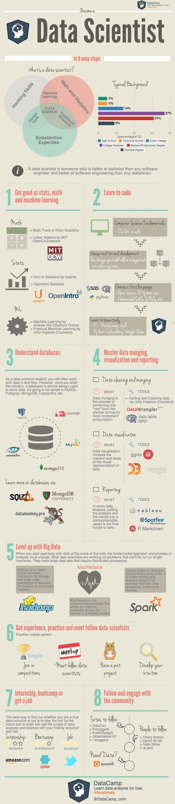

# Qs on [HW3](http://hua-zhou.github.io/teaching/biostatm280-2018winter/hw/hw3/hw3.html)

* Q2(2). Which hour, weekday, month day, and month?

* Details on visualization. There's no standard answer. Use your imagination. 

# Data scientist

## Today

* GCP (cont'd).

* Docker.

