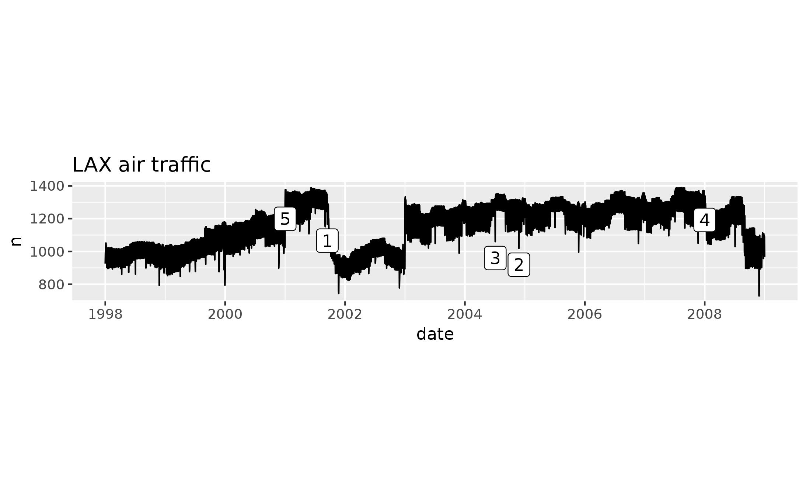

```{r setup, include=FALSE}
knitr::opts_chunk$set(echo = TRUE)
```

Our Apache Yarn cluster hosts the [flights](http://stat-computing.org/dataexpo/2009/the-data.html) data representing 123 million flights over 22 years. Read the [lecture notes](http://hua-zhou.github.io/teaching/biostatm280-2018winter/slides/12-sparklyr/sparklyr-flights.html) on how to access the Yarn cluster. Connect to the database using `sparklyr` and answer following questions. You can base your answers on a specific year or the whole data set.

1. Map the top 10 busiest airports. Size of dots should reflect the number of flights through that destination.  
Hint: You may find this tutorial on [Making Maps in R](http://eriqande.github.io/rep-res-web/lectures/making-maps-with-R.html) helpful.

0. Map the top 10 busiest direct routes. Size of lines should reflect the number of flights through that route.

0. LAX:
  
    <p align="center">
    
    </p>

    1. Reproduce above plot. Visualize and explain some prominent features we observe. For example, what happened at points 1-5?

    0. Visualize and explain seasonal effects.
  
    0. Visualize and explain weekly effects.
  
    0. Map top 10 destinations from LAX. Size of dots should reflect the number of flights from LAX to that destination.
    
0. Build a predictive model for the arrival delay (`arrdelay`) of flights flying from LAX. Use the same filtering criteria as in the [lecture notes](http://hua-zhou.github.io/teaching/biostatm280-2018winter/slides/12-sparklyr/sparklyr-flights.html) to construct training and validation sets. You are allowed to use a maximum of 5 predictors. The prediction performance of your model on the validation data set will be an important factor for grading this question.
    
0. Any other information you want to explore.
  