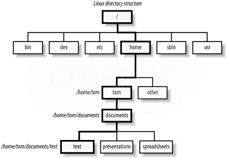
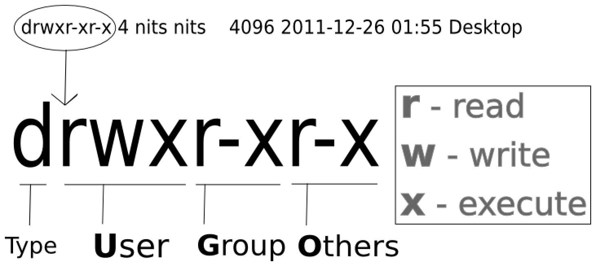
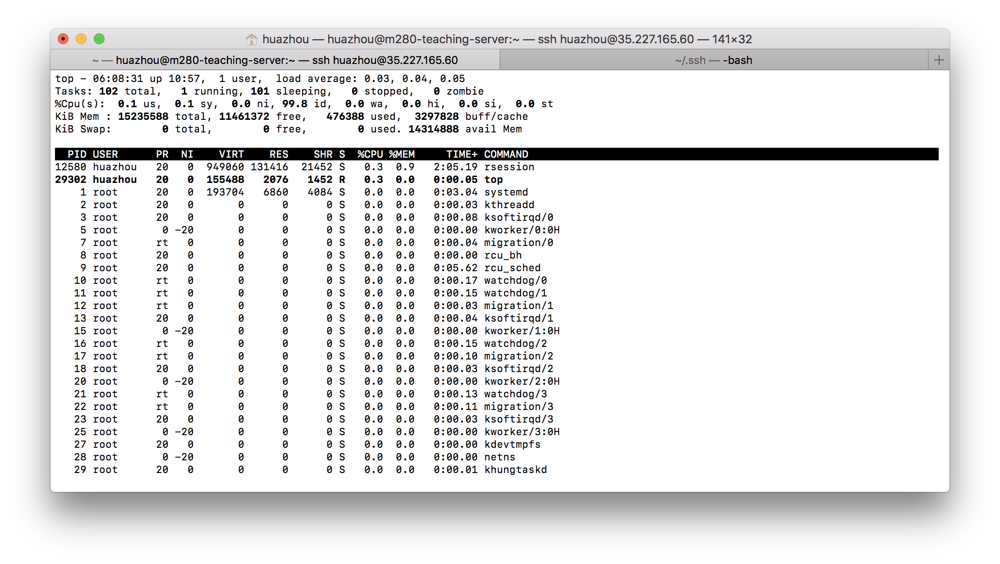
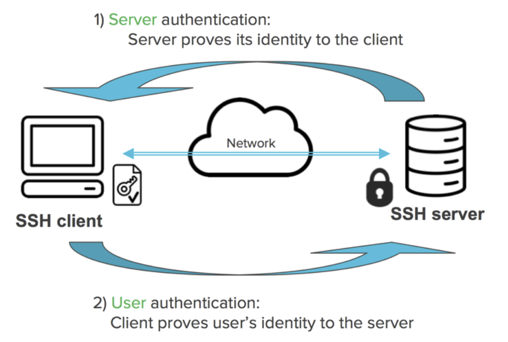

## Why Linux

Linux is _the_ most common platform for scientific computing.

- Open source and community support.

- Things break; when they break using Linux, it's easy to fix.

- Scalability: portable devices (Android, iOS), laptops, servers, clusters, and super computers.
    - E.g. UCLA Hoffmann2 cluster runs on Linux.

- Cost: it's free!

## [Distributions of Linux](http://upload.wikimedia.org/wikipedia/commons/1/1b/Linux_Distribution_Timeline.svg)

- Debian/Ubuntu is a popular choice for personal computers.

- RHEL/CentOS is popular on servers.

- The teaching server for this class runs CentOS 7.

- Mac OS was originally derived from Unix/Linux (Darwin kernel). It is POSIX compliant. Most shell commands we review here apply to Mac OS terminal as well. Windows/DOS, unfortunately, is a totally different breed.

## {.smaller}

- Show distribution/version on Linux:
```{bash}
cat /etc/*-release
```

----

- Show distribution/version on Mac:
```{bash, eval=FALSE}
sw_vers -productVersion
```
or
```{bash, eval=FALSE}
system_profiler SPSoftwareDataType
```

# Linux shells

## Linux shells

- A shell translates commands to OS instructions.

- Most commonly used shells include `bash`, `csh`, `tcsh`, `zsh`, etc.

- Sometimes a script or a command does not run simply because it's written for another shell.

- We mostly use `bash` shell commands in this class.

----

- Determine the current shell:
```{bash}
echo $SHELL
```

- List available shells:
```{bash}
cat /etc/shells
```

----

- Change to another shell:
```{bash, eval=FALSE}
exec bash -l
```
The `-l` option indicates it should be a login shell.

- Change your login shell permanently:
```{bash, eval=FALSE}
chsh -s /bin/bash userid
```
Then log out and log in.

## Bash completion

Bash provides the following standard completion for the Linux users by default. Much less typing errors and time!  

- Pathname completion.  

- Filename completion.  

- Variablename completion: `echo $[TAB][TAB]`.  

- Username completion: `cd ~[TAB][TAB]`.

- Hostname completion `ssh huazhou@[TAB][TAB]`.

- It can also be customized to auto-complete other stuff such as options and command's arguments. Google `bash completion` for more information.

# Navigate file system

## Linux directory structure

<p align="center">
  
</p>
- Upon log in, user is at his/her home directory.

## Move around the file system {.smaller}

- `pwd` prints absolute path to the current working directory:
```{bash}
pwd
```

- `ls` lists contents of a directory:  
```{bash}
ls
```

## {.smaller}

- `ls -l` lists detailed contents of a directory:  
```{bash}
ls -l
```

## {.smaller}

- `ls -al` lists all contents of a directory, including those start with `.` (hidden folders):
```{bash, small=TRUE}
ls -al
```

----

- `..` denotes the parent of current working directory.

- `.` denotes the current working directory.

- `~` denotes user's home directory.

- `/` denotes the root directory.

- `cd ..` changes to parent directory.

- `cd` or `cd ~` changes to home directory.

- `cd /` changes to root directory.

<!-- 
- `pushd` changes the working directory but pushes the current directory into a stack.

- `popd` changes the working directory to the last directory added to the stack.
-->

## File permissions

<p align="center">
  
</p>

<p align="center">
  
</p>

----

- `chmod g+x file` makes a file executable to group members.

- `chmod 751 file` sets permission rwxr-x--x to a file.

- `groups userid` shows which group(s) a user belongs to:
```{bash}
groups huazhou
```

## Manipulate files and directories

- `cp` copies file to a new location.

- `mv` moves file to a new location.

- `touch` creates a text file; if file already exists, it's left unchanged.

- `rm` deletes a file.

- `mkdir` creates a new directory.

- `rmdir` deletes an _empty_ directory.

- `rm -rf` deletes a directory and all contents in that directory (be cautious using the `-f` option ...).

## Find files {.smaller}

- `locate` locates a file by name:
```{bash}
locate linux.Rmd
```

- `which` locates a program:
```{bash}
which R
```

----

- `find` is similar to `locate` but has more functionalities, e.g., select files by age, size, permissions, .... , and is ubiquitous.
```{bash}
find linux.Rmd
```
```{bash}
find /home/huazhou -name linux.Rmd
```

## Wildcard characters {.smaller}

| Wildcard   | Matches                             |
|------------|-------------------------------------|
| `?`        | any single character                |
| `*`        | any character 0 or more times       |
| `+`        | one or more preceding pattern       |
| `^`        | beginning of the line               |
| `[set]`    | any character in set                |
| `[!set]`   | any character not in set            |
| `[a-z]`    | any lowercase letter                |
| `[0-9]`    | any number (same as `[0123456789]`) |

## {.smaller}

```{bash}
# all png files in current folder
ls -l *.png
```

## Regular expression

- Wildcards are examples of regular expressions. 

- _Regular expressions_ are a powerful tool to efficiently sift through large amounts of text: record linking, data cleaning, scraping data from website or other data-feed. 

- Google `regular expressions` to learn.

# Work with text files

## View/peek text files {.smaller}

- `cat` prints the contents of a file:
```{bash}
cat linux.Rmd
```

----

- `head -l` prints the first $l$ lines of a file:
```{bash}
head linux.Rmd
```

----

- `tail -l` prints the last $l$ lines of a file:
```{bash}
tail linux.Rmd
```

----

- `more` browses a text file screen by screen (only downwards). Scroll down one page (paging) by pressing the spacebar; exit by pressing the `q` key.

- `less` is also a pager, but has more functionalities, e.g., scroll upwards and downwards through the input.

- `less` doesn't need to read the whole file, i.e., it loads files faster than `more`.

> `less` is more, and `more` is less. 

----

- `grep` prints lines that match an expression:
```{bash}
grep CentOS linux.Rmd
```

- Find entries with an underscore:
```{bash}
grep *_* linux.Rmd
```

----

- Find all files in current directory with `.Rmd` extension:
```{bash}
ls | grep *.Rmd
```

- Find all directories in the current directory:
```{bash}
ls -al | grep ^d
```

----

- `sed` is a stream editor. E.g., replace `CentOS` by `RHEL` in a text file:
```{bash}
sed 's/CentOS/RHEL/' linux.Rmd | grep RHEL
```

----

- `awk` is a filter and report writer:
```{bash}
# print sorted list of login names
awk -F: '{ print $1 }' /etc/passwd | sort | head -5
```
```{bash}
# print number of lines in a file, as NR stands for Number of Rows
awk 'END { print NR }' /etc/passwd
```

## Piping and redirection

- `|` sends output from one command as input of another command.

- `>` directs output from one command to a file.

- `>>` appends output from one command to a file.

- `<` reads input from a file.

- Combinations of shell commands (`grep`, `sed`, `awk`, ...), piping and redirection, and regular expressions allow us pre-process and reformat huge text files efficiently. See HW1.

## Text editors

<p align="center">
  
</p>
Source: [Editor War](http://en.wikipedia.org/wiki/Editor_war) on Wikipedia.

## Emacs

- `Emacs` is a powerful text editor with extensive support for many languages including `R`, $\LaTeX$, `python`, and `C/C++`; however it's _not_ installed by default on many Linux distributions. 

- Basic survival commands:
    - `emacs filename` to open a file with emacs.  
    - `CTRL-x CTRL-f` to open an existing or new file.  
    - `CTRL-x CTRX-s` to save.  
    - `CTRL-x CTRL-w` to save as.  
    - `CTRL-x CTRL-c` to quit.

----

- Google `emacs cheatsheet`

<p align="center">
  
</p>

`C-<key>` means hold the `control` key, and press `<key>`.  
`M-<key>` means press the `Esc` key once, and press `<key>`.

## Vi

- `Vi` is ubiquitous (POSIX standard). Learn at least its basics; otherwise you can edit nothing on some clusters. 

- Basic survival commands:
    - `vi filename` to start editing a file.
    - `vi` is a _modal_ editor: _insert_ mode and _normal_ mode. Pressing `i` switches from the normal mode to insert mode. Pressing `ESC` switches from the insert mode to normal mode.  
    - `:x<Return>` quits `vi` and saves changes.  
    - `:q!<Return>` quits vi without saving latest changes.  
    - `:w<Return>` saves changes.
    - `:wq<Return>` quits `vi` and saves changes.      

----

- Google `vi cheatsheet`

<p align="center">
  
</p>

## IDE (Integrated Development Environment)

- Statisticians write a lot of code. Critical to adopt a good IDE that goes beyond code editing: syntax highlighting, executing code within editor, debugging, profiling, version control, etc.

- R Studio, Eclipse, Emacs, Matlab, Visual Studio, etc.

## Processes

- OS runs processes on behalf of user.

- Each process has Process ID (PID), Username (UID), Parent process ID (PPID), Time and data process started (STIME), time running (TIME), etc.

```{bash}
ps
```

----

```{bash}
# all current running processes
ps -eaf
```

----

```{bash}
# all python processes
ps -eaf | grep python
```

----

```{bash}
# process with PID=1
ps -fp 1
```

----

```{bash}
# all processes owned by a user
ps -fu huazhou
```

## `kill` processes

- `kill 1001` kills process with PID=1001.

- `killall -r R` kills all R processes.

## `top`

`top` prints realtime process information (very useful).
```{bash, eval=FALSE}
top
```
<p align="center">
  
</p>

# Secure shell (SSH)

## SSH

SSH (secure shell) is the dominant cryptographic network protocol for secure network connection via an insecure network.

- On Linux or Mac, access the teaching server by
```{bash, eval=FALSE}
ssh username@35.227.165.60
```

- Windows machines need the [PuTTY](http://www.putty.org) program (free).

## Use keys over password

- Key authentification is much more secure than password. Most passwords are weak.

- Script or a program may need to systematically SSH into other machines.

- Log into multiple machines using the same key.

- Seamless use of many services: git, svn, Amazon EC2 cloud service, parallel computing on multiple hosts, etc.

- Many servers only allow key authentication and do not accept password authentication.

## Key authentification

<p align="center">
  
</p>

<p align="center">
  
</p>

----

- _Public key_. Put on the machine(s) you want to log in.

- _Private key_. Put on your own computer. Consider this as the actual key in your pocket; never give to others.

- Messages from server to your computer is encrypted with your public key. It can only be decrypted using your private key.

- Messages from your computer to server is signed with your private key (digital signatures) and can be verified by anyone who has your public key (authentication).

## Steps for generate keys

- On Linux or Mac, `ssh-keygen` generates key pairs
```{bash, eval=FALSE}
ssh-keygen -t rsa -f ~/.ssh/[KEY_FILENAME] -C [USERNAME]
```
  `[KEY_FILENAME]` is the name that you want to use for your SSH key files. For example, a filename of `my-ssh-key` generates a private key file named `my-ssh-key` and a public key file named `my-ssh-key.pub`.  
  `[USERNAME]` is the user for whom you will apply this SSH key.   
  Use a (optional) paraphrase different form password.  
    
- Set right permissions on the `.ssh` folder and key files
```{bash, eval=FALSE}
chmod 400 ~/.ssh/[KEY_FILENAME]
```

----

- Append the public key to the `~/.ssh/authorized_keys` file of any Linux machine we want to SSH to, e.g.,
```{bash, eval=FALSE}
ssh-copy-id -i ~/.ssh/[KEY_FILENAME] [USERNAME]@35.227.165.60
```

- Test your new key.
```{bash, eval=FALSE}
ssh -i ~/.ssh/[KEY_FILENAME] [USERNAME]@35.227.165.60
```

- Now you don't need password each time you connect from your machine to the teaching server.

----

- If you set paraphrase when generating keys, you'll be prompted for the paraphrase each time the private key is used. Avoid repeatedly entering the paraphrase by using `ssh-agent` on Linux/Mac or Pagent on Windows.

- Same key pair can be used between any two machines. We don't need to regenerate keys for each new connection.

- For Windows users, the private key generated by `ssh-keygen` cannot be directly used by PuTTY; use PuTTYgen for conversion. Then let PuTTYgen use the converted private key. Read Sections A and B of the [tutorial](http://tipsandtricks.nogoodatcoding.com/2010/02/svnssh-with-tortoisesvn.html).

## Transfer files between machines

- `scp` securely transfers files between machines using SSH.
```{bash, eval=FALSE}
## copy file from local to remote
scp localfile username@35.227.165.60:/pathtofolder
```
```{bash, eval=FALSE}
## copy file from remote to local
scp username@35.227.165.60:/pathtofile pathtolocalfolder
```

- `sftp` is FTP via SSH.

- GUIs for Windows (WinSCP) or Mac (Cyberduck).

- (My preferred way) Use a **version control system** to sync project files between different machines and systems.

## Line breaks in text files

- Windows uses a pair of `CR` and `LF` for line breaks. 

- Linux/Unix uses an `LF` character only. 

- Mac X also uses a single `LF` character. But old Mac OS used a single `CR` character for line breaks. 

- If transferred in binary mode (bit by bit) between OSs, a text file could look a mess. 

- Most transfer programs automatically switch to text mode when transferring text files and perform conversion of line breaks between different OSs; but I used to run into problems using WinSCP. Sometimes you have to tell WinSCP explicitly a text file is being transferred.

# Run R in Linux

## Interactive mode

- Start R in the interactive mode by typing `R` in shell.

## Batch mode {.smaller}

- Demo script [`meanEst.R`](./slides/02-linux/meanEst.R) implements a terrible estimator of mean
```{bash}
cat meanEst.R
```

----

To run your R code non-interactively aka in batch mode, we have at least two options.

- `R CMD BATCH`:
```{bash, eval=FALSE}
# default output to meanEst.Rout
R CMD BATCH meanEst.R
```

- `Rscript`:
```{bash, eval=FALSE}
# output to stdout
Rscript meanEst.R
```

- Typically automate `BATCH` calls using a scripting language, e.g., python, perl, and shell script.

## Pass arguments to R

- Specify arguments via `R CMD BATCH`:
```{bash, eval=FALSE}
R CMD BATCH '--args mu=1 sig=2 kap=3' script.R
```

- Specify arguments via `Rscript`:
```{bash, eval=FALSE}
Rscript script.R mu=1 sig=2 kap=3
```

- Parse command line arguments using magic formula
```{r, eval=FALSE}
for (arg in commandArgs(T)) {
  eval(parse(text=arg))
}
```
After calling the above code, all command line arguments will be available in the global namespace.

----

- Understand the magic formula `parse` and `eval`:
```{r, error=TRUE}
print(x)
parse(text="x=3")
eval(parse(text="x=3"))
print(x)
```

----

- Script [`runSim.R`](./slides/02-linux/runSim.R) has components: method implementation, argument parser, data generator with unspecified parameter `n`, and estimation based on generated data.

- Call `runSim.R` with sample size `n=100`:
```{bash}
R CMD BATCH '--arg n=10` runSim.R
```

```{bash}
Rscript runSim.R n=10
```

## Run time consuming jobs

- Many statistical computing tasks takes long: simulation, MCMC, etc.

- `nohup` command in Linux runs program(s) immute to hangups and writes output to `nohup.out` by default. Logging out will _not_ kill the process.

- `nohup` is in the POSIX standard thus is available on both Linux and MacOS.

```{bash}
nohup Rscript runSim.R n=100 &
```
`&` runs the job in background.

## `screen`

- `screen` is another popular utility, but not installed by default. 

- Typical workflow using `screen`.

0. Access remote server using `ssh`.

0. Start jobs in batch mode.

0. Detach jobs.

0. Exit from server, wait for jobs to finish.

0. Access remote server using `ssh`.

0. Re-attach jobs, check on progress, get results, etc.

## Use R to call R

R in conjuction with `nohup` or `screen` can be used to orchestrate a large simulation study.

- it can be more elegant, transparent, and robust to parallelize jobs corresponding to different scenarios (e.g., different generative models) outside of the code used to do statistical computation.

- We'll consider a simulation study in R but the same approach could be used with code written in Julia, Matlab, Python, etc.

- Python in many ways makes a better _glue_ we may discuss this later in the course.

----

- Suppose we have 
    - R script `runSim.R` which run a simulation based on command line arguments `n`.  
    - A large collection of `n` values that we want to use in our simulation study.  
    - Access to a server with 128 cores.  
    
- Option 1: manually call `runSim.R` for each setting.

- Option 2: automate calls using R and `nohup`.

