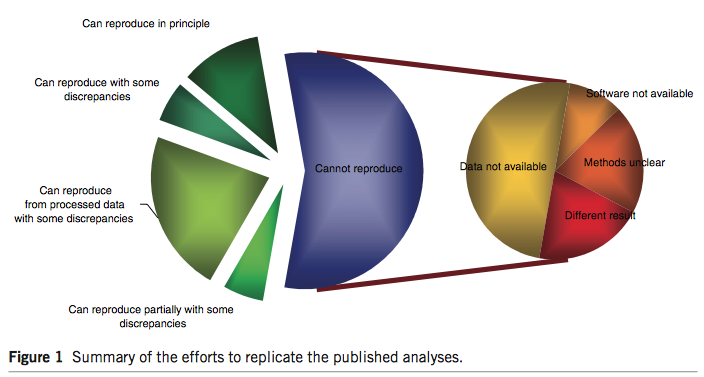

## {.flexbox .vcenter}

> An article about computational science in a scientific publication is **not** the scholarship itself, it is merely **advertising** of the scholarship. The actual scholarship is the complete software development environment and the complete set of instructions which generated the figures.
>
> @BuckheitDonoho95ReproRes

## Non-reproducible research | [Duke Potti scandal](https://en.wikipedia.org/wiki/Anil_Potti)

<p align="center">
  
</p>

----

- @Potti06GenomeSignature: <https://www.nature.com/articles/nm1491>

- @BaggerlyCoombes09: <https://projecteuclid.org/euclid.aoas/1267453942>

- [Simply Statistics Blog: The Duke Saga Starter Set](https://simplystatistics.org/2012/02/27/the-duke-saga-starter-set/)

   
## Non-reproducible research | Microarray studies

<p align="center">
  
</p>


Nature Genetics (2015 Impact Factor: 31.616). 20 articles about microarray profiling published in Nature Genetics between Jan 2005 and Dec 2006.

## Non-reproducible research | Bible code

<p align="center">
  
</p>

- @WitztumRipsRosenberg94BibleCode

- @McKayBarNatanBarHillelKalai99BibleCode

## Why reproducible research {.smaller}

- Reproducibility has been a foundation of science. It helps accumulate scientific knowledge.

- Greater research impact.

- Better work habit boosts quality of research.

- Better teamwork. For **you** as graduate students, it means better communication with your advisor.

    ```{r, eval=FALSE}
    while true  
      Stud: "that idea you told me to try - it doesn't work!"  
      Prof: "ok. how about trying this instead."
    end
    ```
Unless you reproduce the computing environment (algorithms, dataset, tuning parameters), there's no way others can help you.

## How to be reproducible in statistics?

> When we publish articles containing figures which were generated by computer, we also publish the complete software environment which generates the figures.
>
> @BuckheitDonoho95ReproRes

- A good example: <http://stanford.edu/~boyd/papers/admm_distr_stats.html>

- I highly recommend the book _Reproducible Research with R and RStudio_ by Christopher Gandrud. 

    - [Amazon](https://www.amazon.com/Reproducible-Research-Studio-Chapman-Hall/dp/1466572841)
    
    - [GitHub repo](https://github.com/christophergandrud/Rep-Res-Book)

## Tools for reproducible research

- Version control: Git+GitHub.

- Distribute method implementation, e.g., R packages, on GitHub or bitbucket.

- Dynamic document: RMarkdown for R or [Jupyter](http://jupyter.org) for Julia/Python/R.

- Docker container for reproducing a computing environment.

- Cloud computing tools.

- We are going to practice reproducible research **now**. That is to make your homework reproducible using Git, GitHub, and RMarkdown.

## References {.smaller}

