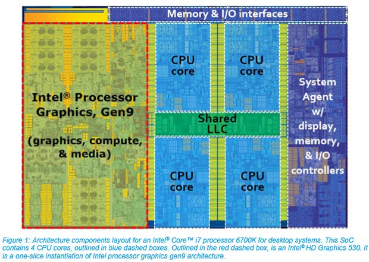

```{r setup, include=FALSE}
knitr::opts_chunk$set(echo = TRUE)
```

# The why of databases

## Size of data

My heuristics:

- Small data: those can fit into computer memory.

- Bigish data: those can fit into disk(s) of a single machine.

- Big data: those cannot fit into disk(s) of a single machine. 

## Computer architecture

> Key to high performance is effective use of memory hierarchy. True on all architectures.

<p align="center">

</p>

<p align="center">

</p>

<p align="center">

</p>


## Numbers everyone should know

| Operation                           | Time           |
|-------------------------------------|----------------|
| L1 cache reference                  | 0.5 ns         |
| Branch mispredict                   | 5 ns           |
| L2 cache reference                  | 7 ns           |
| Mutex lock/unlock                   | 100 ns         |
| Main memory reference               | 100 ns         |
| Compress 1K bytes with Zippy        | 10,000 ns      |
| Send 2K bytes over 1 Gbps network   | 20,000 ns      |
| Read 1 MB sequentially from memory  | 250,000 ns     |
| Round trip within same datacenter   | 500,000 ns     |
| Disk seek                           | 10,000,000 ns  |
| Read 1 MB sequentially from network | 10,000,000 ns  |
| Read 1 MB sequentially from disk    | 30,000,000 ns  |
| Send packet CA->Netherlands->CA     | 150,000,000 ns |

Source: <https://surana.wordpress.com/2009/01/01/numbers-everyone-should-know/>  
<http://www2.stat.duke.edu/~cr173/Sta523_Fa17/sql.html>

## Implications for bigish data

Suppose we have a 10 GB flat data file and that we want to select certain rows based on a given criteria. This requires a sequential read across the entire data set.

If we can store the file in memory:  
    10 GB×(250 μs/1 MB)=0.25 seconds  
    
If we have to access the file from disk:  
    10 GB×(30 ms/1 MB)=30 seconds
    
This is just for reading data, if we make any modifications (writing) things are much worse.

## Blocks

Cost: Disk << Memory

Speed: Disk <<< Memory

So usually possible to grow our disk storage to accommodate our data. However, memory is usually the limiting resource, and if we can’t fit everything into memory?

Create blocks - group rows based on similar attributes and read in multiple rows at a time. Optimal size will depend on the task and the properties of the disk.

## Linear vs binary Search

Even with blocks, any kind of subsetting of rows requires a linear search, which requires $O(N)$ accesses where $N$ is the number of blocks.

We can do much better if we are careful about how we structure our data, specifically sorting some or all of the columns.

* Sorting is expensive, $O(N \log N)$, but it only needs to be done once.

* After sorting, we can use a binary search for any subsetting tasks $O(\log N)$.

* These sorted columns are known as _indexes_.

* Indexes require additional storage, but usually small enough to be kept in memory while blocks stay on disk.

