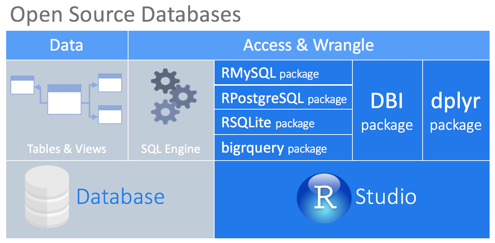

```{r setup, include=FALSE}
knitr::opts_chunk$set(echo = TRUE)
```

## Acknowledgement

Most material in this lecture is adpated from <http://www2.stat.duke.edu/~cr173/Sta523_Fa17/sql.html> and <http://www2.stat.duke.edu/~cr173/Sta523_Fa17/bigish_data.html>.

# The why of databases

## Size of data

- Small data: those can fit into computer memory.

- Bigish data: those can fit into disk(s) of a single machine.

- Big data: those cannot fit into disk(s) of a single machine. 

## Computer architecture

> Key to high performance is effective use of memory hierarchy. True on all architectures.

<p align="center">

</p>

<p align="center">

</p>

<p align="center">

</p>


## Numbers everyone should know

| Operation                           | Time           |
|-------------------------------------|----------------|
| L1 cache reference                  | 0.5 ns         |
| L2 cache reference                  | 7 ns           |
| Main memory reference               | 100 ns         |
| Read 1 MB sequentially from memory  | 250,000 ns     |
| Read 1 MB sequentially from network | 10,000,000 ns  |
| Read 1 MB sequentially from disk    | 30,000,000 ns  |


<!-- | Operation                           | Time           | -->
<!-- |-------------------------------------|----------------| -->
<!-- | L1 cache reference                  | 0.5 ns         | -->
<!-- | Branch mispredict                   | 5 ns           | -->
<!-- | L2 cache reference                  | 7 ns           | -->
<!-- | Mutex lock/unlock                   | 100 ns         | -->
<!-- | Main memory reference               | 100 ns         | -->
<!-- | Compress 1K bytes with Zippy        | 10,000 ns      | -->
<!-- | Send 2K bytes over 1 Gbps network   | 20,000 ns      | -->
<!-- | Read 1 MB sequentially from memory  | 250,000 ns     | -->
<!-- | Round trip within same datacenter   | 500,000 ns     | -->
<!-- | Disk seek                           | 10,000,000 ns  | -->
<!-- | Read 1 MB sequentially from network | 10,000,000 ns  | -->
<!-- | Read 1 MB sequentially from disk    | 30,000,000 ns  | -->
<!-- | Send packet CA->Netherlands->CA     | 150,000,000 ns | -->

Source: <https://surana.wordpress.com/2009/01/01/numbers-everyone-should-know/>  

## Implications for bigish data

Suppose we have a 10 GB flat data file and that we want to select certain rows based on a given criteria. This requires a sequential read across the entire data set.

If we can store the file in memory:  
    10 GB×(250 μs/1 MB)=0.25 seconds  
    
If we have to access the file from disk:  
    10 GB×(30 ms/1 MB)=30 seconds
    
This is just for reading data, if we make any modifications (writing) things are much worse.

## Blocks

Cost: Disk << Memory

Speed: Disk <<< Memory

So usually possible to grow our disk storage to accommodate our data. However, memory is usually the limiting resource, and if we can’t fit everything into memory?

Create blocks - group rows based on similar attributes and read in multiple rows at a time. Optimal size will depend on the task and the properties of the disk.

## Linear vs binary Search

Even with blocks, any kind of subsetting of rows requires a linear search, which requires $O(N)$ accesses where $N$ is the number of blocks.

We can do much better if we are careful about how we structure our data, specifically sorting some or all of the columns.

* Sorting is expensive, $O(N \log N)$, but it only needs to be done once.

* After sorting, we can use a binary search for any subsetting tasks $O(\log N)$.

* These sorted columns are known as _indexes_.

* Indexes require additional storage, but usually small enough to be kept in memory while blocks stay on disk.

# Databases

## SQL

**S**tructures **Q**uery **L**anguage is a special purpose language for interacting with (querying and modifying) these indexed tabular data structures.

* ANSI Standard but with some dialect divergence.

* This functionality maps very closely (but not exactly) with the data manipulation verbs present in dplyr.

* We will see this mapping in more detail in a bit.

## Access databases from R

<p align="center">

</p>

- dplyr package supports a variety of databases. 
    - Open source databases: SQLite, MySQL, PostgreSQL, BigQuery.
    - Commercial databases: Oracle, Microsoft SQL Server.
    - See [link](https://db.rstudio.com/databases) for a complete list.

- DBI package provides a common interface for connecting to databases.

- dbplyr package is the backend that translates dplyr verbs to database SQL queries.

- To install database drivers, follow instructions at <https://db.rstudio.com/best-practices/drivers/>.

# A sample session using SQLite

## Create a SQLite database

Create a SQLite database _in memory_ for learning purpose.
```{r}
library("DBI")
library("RSQLite")

con = dbConnect(RSQLite::SQLite(), "employee.sqlite")
#con = dbConnect(RSQLite::SQLite(), ":memory:")
str(con)
```

## Add a table into database

First table:
```{r}
(employees <- data.frame(name   = c("Alice","Bob","Carol","Dave","Eve","Frank"),
                         email  = c("alice@company.com", "bob@company.com",
                                    "carol@company.com", "dave@company.com",
                                    "eve@company.com",   "frank@comany.com"),
                         salary = c(52000, 40000, 30000, 33000, 44000, 37000),
                         dept   = c("Accounting", "Accounting","Sales",
                                    "Accounting","Sales","Sales"),
                         stringsAsFactors = FALSE))
```
Second table:
```{r}
(phone <- data.frame(name  = c("Bob", "Carol", "Eve", "Frank"),
                     phone = c("919 555-1111", "919 555-2222", "919 555-3333", "919 555-4444")))
```

Write table in to the database:
```{r}
dbWriteTable(con, "employees", employees, overwrite = TRUE)
dbWriteTable(con, "phone", phone, overwrite = TRUE)
dbListTables(con)
```

## Add another table

```{r}
dbWriteTable(con, "employs", employees)
dbListTables(con)
```


## Remove a table from database

```{r}
dbRemoveTable(con,"employs")
dbListTables(con)
```

## Querying tables

```{r}
res <- dbSendQuery(con, "SELECT * FROM employees")
dbFetch(res)
dbClearResult(res)
```

## Closing the connection

```{r}
dbDisconnect(con)
```

# SQL Queries

## Connecting

```{r}
con <- dbConnect(RSQLite::SQLite(), dbname = "employee.sqlite")
dbListTables(con)
knitr::opts_chunk$set(connection = "con")
```

## SELECT statements

```{sql}
SELECT * FROM employees;
```

```{sql}
SELECT * FROM phone;
```


## Select using SELECT

```{sql}
SELECT name AS first_name, salary FROM employees;
```

## Arrange using ORDER BY

```{sql}
SELECT name AS first_name, salary FROM employees ORDER BY salary;
```

Descending order:
```{sql}
SELECT name AS first_name, salary FROM employees ORDER BY salary DESC;
```

## Filter via WHERE

```{sql}
SELECT * FROM employees WHERE salary < 40000
```

## Group_by via GROUP BY

```{sql}
SELECT * FROM employees GROUP BY dept;
```

## Head via LIMIT

```{sql}
SELECT * FROM employees LIMIT 3;
SELECT * FROM employees ORDER BY name DESC LIMIT 3;
```

## Join two tables (default)

By default SQLite uses a `CROSS JOIN` which is not terribly useful
```{sql}
SELECT * FROM employees JOIN phone;
```

## Inner join by NATURAL

```{sql}
SELECT * FROM employees NATURAL JOIN phone;
```

## Inner join - explicit

```{sql}
SELECT * FROM employees JOIN phone ON employees.name = phone.name;
```

## Left join - natural

```{sql}
SELECT * FROM employees NATURAL LEFT JOIN phone;
```

## Left join - explicit

```{sql}
SELECT * FROM employees LEFT JOIN phone ON employees.name = phone.name;
```

## Other joins

SQLite does not support directly an `OUTER JOIN` or a `RIGHT JOIN`.

## Creating indices

```{sql}
CREATE INDEX index_name ON employees (name);
```

```{sql}
CREATE INDEX index_name_email ON employees (name, email);
```

```{bash}
sqlite3 employee.sqlite .indices
```

## Close connection

```{r}
dbDisconnect(con)
```

