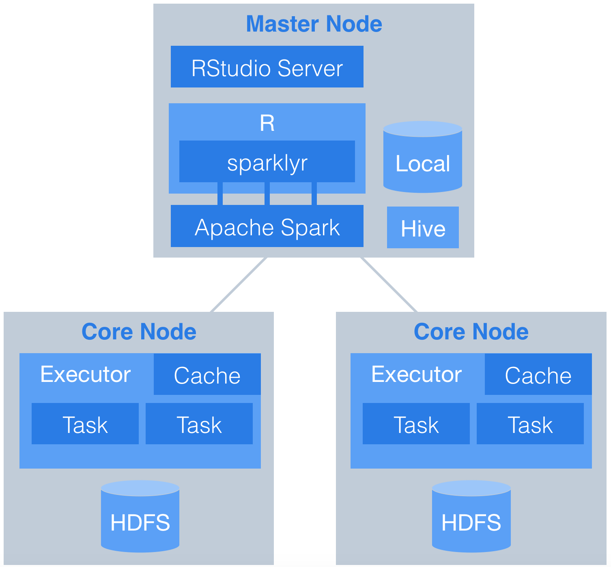
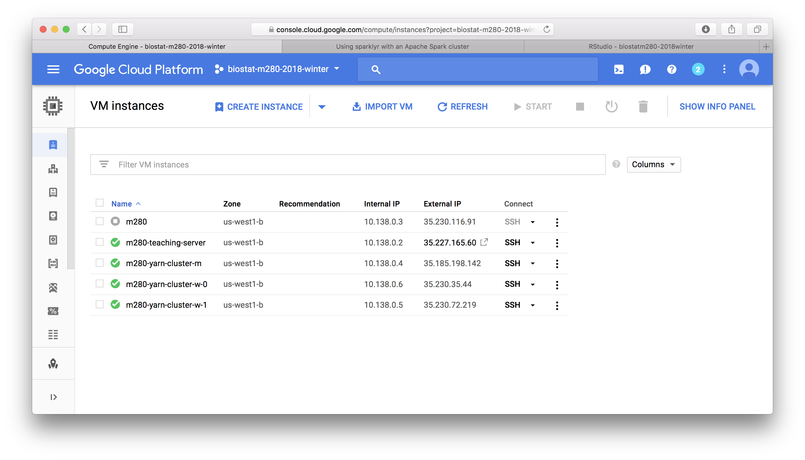

```{r setup, include=FALSE}
knitr::opts_chunk$set()
```

```{r}
sessionInfo()
```

In this tutorial, we do some exploratory data analysis of the distributed data in a Hadoop YARN cluster. Again it is adapted from the [tutorial at RStudio](http://spark.rstudio.com/examples/yarn-cluster-emr/).

<p align="center">
{width=300px}
</p>

## Log in the Hadoop YARN cluster

- GCP YARN cluster master node has IP address `35.185.198.142` and is serving RStudio at [`http://35.185.198.142:8787`](http://35.185.198.142:8787).

<p align="center">
{width=500px}
</p>

- Your username is same as on the teaching server and the default password is `m280`. Change password via `passwd` command immediately after your first login.

- To work on your HW4 on the YARN master node, you may first `git clone` your `biostat-m280-2018-winter` repo and create a project.

- `tidyverse`, `DBI`, `sparklyr` are already installed globally so you don't have to install them.

## Connect to Spark

```{r}
# Connect to Spark
library(sparklyr)
library(dplyr)
library(ggplot2)
Sys.setenv(SPARK_HOME="/usr/lib/spark")
config <- spark_config()
sc <- spark_connect(master = "yarn-client", config = config)
sc
```

## Access Hive tables

Create dplyr reference to the Spark DataFrame.
```{r}
# Cache flights Hive table into Spark
#tbl_cache(sc, 'flights')
system.time(
  flights_tbl <- tbl(sc, 'flights')
)
flights_tbl %>% print(width = Inf)
```

```{r}
# Cache airlines Hive table into Spark
#tbl_cache(sc, 'airlines')
airlines_tbl <- tbl(sc, 'airlines')
airlines_tbl %>% print(width = Inf)
```

```{r}
# Cache airports Hive table into Spark
#tbl_cache(sc, 'airports')
airports_tbl <- tbl(sc, 'airports')
airports_tbl %>% print(width = Inf)
```

## How many data points

Across whole data set:
```{r}
flights_tbl %>%
  group_by(year) %>%
  count() %>%
  arrange(year) %>%
  collect()
```

How many flights from LAX per year:
```{r}
flights_tbl %>%
  filter(origin == "LAX") %>%
  group_by(year) %>%
  count() %>%
  arrange(year) %>%
  collect() %>%
  ggplot(aes(x = year, y = n)) + 
    geom_col() +
    labs(title = "Number of flights from LAX")
```

How many flights to LAX per year:
```{r}
flights_tbl %>%
  filter(dest == "LAX") %>%
  group_by(year) %>%
  count() %>%
  arrange(year) %>%
  collect() %>%
  ggplot(aes(x = year, y = n)) + 
    geom_col() +
    labs(title = "Number of flights to LAX")
```

## Create a model data set

```{r}
# Filter records and create target variable 'gain'
system.time(
  model_data <- flights_tbl %>%
    filter(!is.na(arrdelay) & !is.na(depdelay) & !is.na(distance)) %>%
    filter(depdelay > 15 & depdelay < 240) %>%
    filter(arrdelay > -60 & arrdelay < 360) %>%
    filter(year >= 2003 & year <= 2007) %>%
    left_join(airlines_tbl, by = c("uniquecarrier" = "code")) %>%
    mutate(gain = depdelay - arrdelay) %>%
    select(year, month, arrdelay, depdelay, distance, uniquecarrier, description, gain)
)
model_data
```

```{r}
# Summarize data by carrier
model_data %>%
  group_by(uniquecarrier) %>%
  summarize(description = min(description), gain=mean(gain), 
            distance=mean(distance), depdelay=mean(depdelay)) %>%
  select(description, gain, distance, depdelay) %>%
  arrange(gain)
```

## Train a linear model

Predict time gained or lost in flight as a function of distance, departure delay, and airline carrier.
```{r}
# Partition the data into training and validation sets
system.time(
  model_partition <- model_data %>% 
    sdf_partition(train = 0.8, valid = 0.2, seed = 5555)
)

# Fit a linear model
system.time(
  ml1 <- model_partition$train %>%
    ml_linear_regression(gain ~ distance + depdelay + uniquecarrier)
)

# Summarize the linear model
summary(ml1)
```

## Assess model performance

Compare the model performance using the validation data.
```{r}
# Calculate average gains by predicted decile
system.time(
  model_deciles <- lapply(model_partition, function(x) {
    sdf_predict(ml1, x) %>%
      mutate(decile = ntile(desc(prediction), 10)) %>%
      group_by(decile) %>%
      summarize(gain = mean(gain)) %>%
      select(decile, gain) %>%
      collect()
  })
)

# Create a summary dataset for plotting
deciles <- rbind(
  data.frame(data = 'train', model_deciles$train),
  data.frame(data = 'valid', model_deciles$valid),
  make.row.names = FALSE
)

# Plot average gains by predicted decile
deciles %>%
  ggplot(aes(factor(decile), gain, fill = data)) +
  geom_bar(stat = 'identity', position = 'dodge') +
  labs(title = 'Average gain by predicted decile', x = 'Decile', y = 'Minutes')
```

## Visualize predictions

Compare actual gains to predicted gains for an out of time sample.
```{r}
# Select data from an out of time sample
system.time(
data_2008 <- flights_tbl %>%
  filter(!is.na(arrdelay) & !is.na(depdelay) & !is.na(distance)) %>%
  filter(depdelay > 15 & depdelay < 240) %>%
  filter(arrdelay > -60 & arrdelay < 360) %>%
  filter(year == 2008) %>%
  left_join(airlines_tbl, by = c("uniquecarrier" = "code")) %>%
  mutate(gain = depdelay - arrdelay) %>%
  select(year, month, arrdelay, depdelay, distance, uniquecarrier, description, gain, origin,dest)
)

# Summarize data by carrier
carrier <- sdf_predict(ml1, data_2008) %>%
  group_by(description) %>%
  summarize(gain = mean(gain), prediction = mean(prediction), freq = n()) %>%
  filter(freq > 10000) %>%
  collect()

# Plot actual gains and predicted gains by airline carrier
ggplot(carrier, aes(gain, prediction)) + 
  geom_point(alpha = 0.75, color = 'red', shape = 3) +
  geom_abline(intercept = 0, slope = 1, alpha = 0.15, color = 'blue') +
  geom_text(aes(label = substr(description, 1, 20)), size = 3, alpha = 0.75, vjust = -1) +
  labs(title='Average Gains Forecast', x = 'Actual', y = 'Predicted')
```

Some carriers make up more time than others in flight, but the differences are relatively small. The average time gains between the best and worst airlines is only six minutes. The best predictor of time gained is not carrier but flight distance. The biggest gains were associated with the longest flights.

## Disconnect from Spark

```{r}
spark_disconnect_all()
```