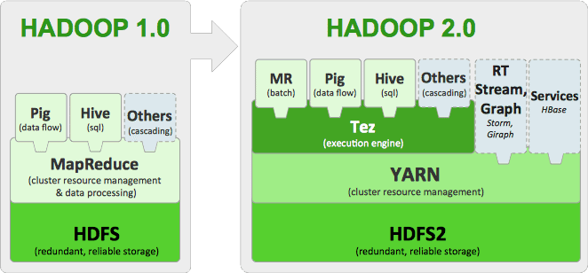
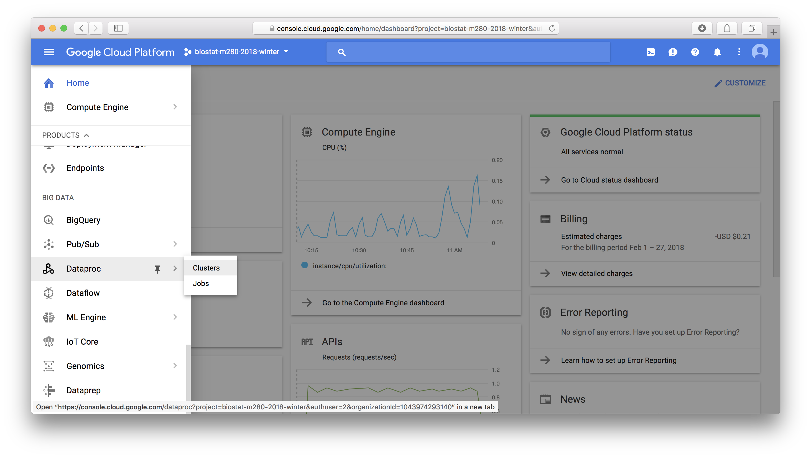
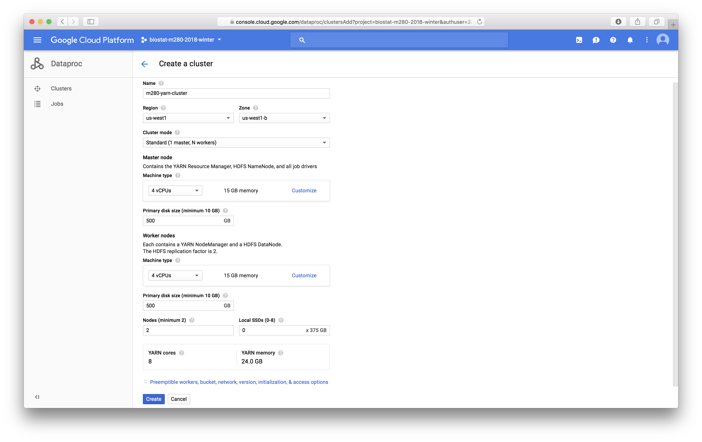
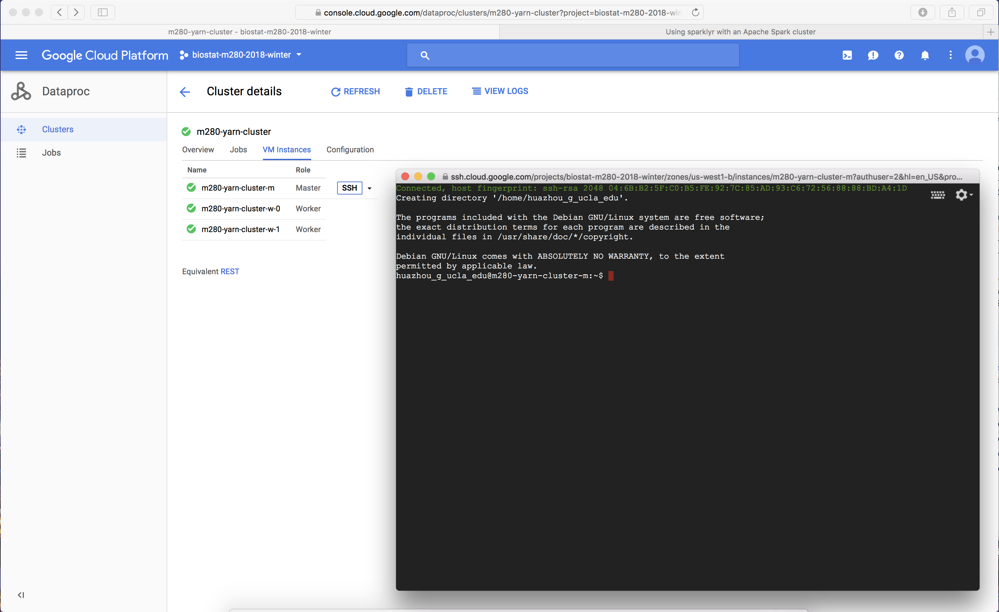

```{r setup, include=FALSE}
knitr::opts_chunk$set()
```

# Hadoop ecosystem for big data

Hadoop, HDFS, MapReduce, YARN, Spark, Hive, Pig, ...

<p align="center">
{width=500px}
</p>

- **Hadoop** is the leading open-source software _framework_ developed for scalable, reliable and distributed computing. It implements **HDFS** (Hadoop’s distributed file system), which facilitates the storage, management and rapid analysis of vast datasets across distributed clusters of servicers.

- Hadoop **Yarn** is programming model for processing and generating large sets of data. Yarn is the successor of Hadoop **MapReduce**.

- **Hive** was designed to automatically translate SQL-like queries into MapReduce jobs on Hadoop.

- **Spark** is a powerful Hadoop processing engine (SQL queries, streaming data, ML algorithm) that can handle both batch and streaming workloads at lightning fast speeds.

- **Pig** is a platform for analysing large sets of data.

# Tutorial

In this tutorial, we learn to:

- set up a YARN cluster (1 master node, 2 worker nodes) on GCP

- download data files and deposit them into HDFS

- creat Hive tables that map to files in HDFS

- install R/RStudio on YARN master node

- set up regular accounts so students can use RStudio on the master node


It is adapted from the [tutorial at RStudio](http://spark.rstudio.com/examples/yarn-cluster-emr/) on setting up YARN cluster on AWS. GCP `Dataproc` is the equivalent of `EMR` in AWS.

## Set up a YARN cluster in GCP

In GCP console, click `Dataproc` -> `Clusters` to create a YARN cluster.
<p align="center">
{width=500px}
</p>
Settings for the YARN cluster are mostly self-explanatory:
<p align="center">
{width=500px}
</p>

## Connect to the YARN manager

Click the `SSH` button next to the master node brings up a browser terminal that logs in the YARN master node as the (super)user `YOUR_GOOGLE_ACCOUNT_NAME`:
<p align="center">
{width=500px}
</p>

## Create a user

Create a user called `rstudio-user` that will perform the data analysis. Create a user directory for `rstudio-user` on HDFS with the `hadoop fs` command.
```{bash, eval = FALSE}
# Make User
sudo useradd -m rstudio-user
sudo passwd rstudio-user

# Create new directory in hdfs
hadoop fs -mkdir /user/rstudio-user
hadoop fs -chmod 777 /user/rstudio-user
```

## Download the flights data

The [flights](http://stat-computing.org/dataexpo/2009/the-data.html) data is a well known data source representing 123 million flights over 22 years. It consumes roughly 12 GiB of storage in uncompressed CSV format in yearly files.

Switch user. For data loading and analysis, make sure you are logged in as regular user.
```{bash, eval = FALSE}
# switch user
su rstudio-user
# change to bash shell 
exec bash -l
# change login shell to bash permanently
chsh -s /bin/bash rstudio-user
```
Run the following script to download data from the web onto your master node. Download the yearly flight data and the airlines lookup table.
```{bash, eval = FALSE}
# Make download directory
mkdir /tmp/flights

# Download flight data by year
for i in {1987..2008}
  do
    echo "$(date) $i Download"
    fnam=$i.csv.bz2
    wget -O /tmp/flights/$fnam http://stat-computing.org/dataexpo/2009/$fnam
    echo "$(date) $i Unzip"
    bunzip2 /tmp/flights/$fnam
  done

# Download airline carrier data
wget -O /tmp/airlines.csv http://www.transtats.bts.gov/Download_Lookup.asp?Lookup=L_UNIQUE_CARRIERS

# Download airports data
wget -O /tmp/airports.csv https://raw.githubusercontent.com/jpatokal/openflights/master/data/airports.dat
```
Peek into the data:
```{bash, eval = FALSE}
head /tmp/flights/1987.csv 
```

## Distribute into HDFS

Copy data into HDFS using the hadoop fs command.
```{bash, eval = FALSE}
# Copy flight data to HDFS
hadoop fs -mkdir /user/rstudio-user/flights/
hadoop fs -put /tmp/flights /user/rstudio-user/

# Copy airline data to HDFS
hadoop fs -mkdir /user/rstudio-user/airlines/
hadoop fs -put /tmp/airlines.csv /user/rstudio-user/airlines

# Copy airport data to HDFS
hadoop fs -mkdir /user/rstudio-user/airports/
hadoop fs -put /tmp/airports.csv /user/rstudio-user/airports
```

## Create Hive tables

Launch Hive from the command line.
```{bash, eval = FALSE}
# Open Hive prompt
hive
```
Create the metadata that will structure the flights table. Load data into the Hive table.
```{bash, eval = FALSE}
# Create metadata for flights
CREATE EXTERNAL TABLE IF NOT EXISTS flights
(
year int,
month int,
dayofmonth int,
dayofweek int,
deptime int,
crsdeptime int,
arrtime int, 
crsarrtime int,
uniquecarrier string,
flightnum int,
tailnum string, 
actualelapsedtime int,
crselapsedtime int,
airtime string,
arrdelay int,
depdelay int, 
origin string,
dest string,
distance int,
taxiin string,
taxiout string,
cancelled int,
cancellationcode string,
diverted int,
carrierdelay string,
weatherdelay string,
nasdelay string,
securitydelay string,
lateaircraftdelay string
)
ROW FORMAT DELIMITED
FIELDS TERMINATED BY ','
LINES TERMINATED BY '\n'
TBLPROPERTIES("skip.header.line.count"="1");

# Load data into table
LOAD DATA INPATH '/user/rstudio-user/flights' INTO TABLE flights;
```
Create the metadata that will structure the airlines table. Load data into the Hive table.
```{bash, eval = FALSE}
# Create metadata for airlines
CREATE EXTERNAL TABLE IF NOT EXISTS airlines
(
Code string,
Description string
)
ROW FORMAT SERDE 'org.apache.hadoop.hive.serde2.OpenCSVSerde'
WITH SERDEPROPERTIES
(
"separatorChar" = '\,',
"quoteChar"     = '\"'
)
STORED AS TEXTFILE
tblproperties("skip.header.line.count"="1");

# Load data into table
LOAD DATA INPATH '/user/rstudio-user/airlines' INTO TABLE airlines;
```
Create the metadata that will structure the airports table. Load data into the Hive table.
```{bash, eval = FALSE}
# Create metadata for airports
CREATE EXTERNAL TABLE IF NOT EXISTS airports
(
id string,
name string,
city string,
country string,
faa string,
icao string,
lat double,
lon double,
alt int,
tz_offset double,
dst string,
tz_name string
)
ROW FORMAT SERDE 'org.apache.hadoop.hive.serde2.OpenCSVSerde'
WITH SERDEPROPERTIES
(
"separatorChar" = '\,',
"quoteChar"     = '\"'
)
STORED AS TEXTFILE;

# Load data into table
LOAD DATA INPATH '/user/rstudio-user/airports' INTO TABLE airports;
```

## Install R/RStudio Server on master node

Install dependencies:
```{bash, eval = FALSE}
# Update
sudo apt-get update
# used for devtools
sudo apt-get install libcurl4-openssl-dev libssl-dev libxml2-dev
```
Update R on master node:
```{bash, eval = FALSE}
sudo apt-get install r-base r-base-dev
```
Install commonly used R packages so they're globally available to all users:
```{bash, eval = FALSE}
sudo R -e "install.packages(c('tidyverse', 'DBI', 'sparklyr', 'caTools', 'bitops'), repos='https://cran.rstudio.com/')"
```
Install RStudio Server:
```{bash, eval = FALSE}
sudo apt-get install gdebi-core
wget https://download2.rstudio.org/rstudio-server-1.1.423-amd64.deb
sudo gdebi rstudio-server-1.1.423-amd64.deb
```
RStudio Server will be automatically started upon successful installation. 

By default, port 8787 used by R Studio Server is blocked by VM firewall. On GCP console, go to VPC network and then Firewall rules, create a rule for R Studio Server (tcp: 8787), apply that rule to the YARN master node.

Now you should be able to access R Studio Server on YARN master node by pointing your browser to address `http://ip-address:8787`.

Run following script to set up student's accounts on YARN master node with default password `m280` (need sudo rights): 
```{bash, eval = FALSE}
ulist=("huazhou" "juhkim111" "andrewngu" "anorthrup" "bryanlin24" "chad.e.pickering" "c.shaw" "david.levy" "emjcampos" "ericasu" "gaoshuang" "huiyuhu" "jayxu33" "jboland521" "jiayunli" "katywang" "l4luo" "lishanpeng0913" "luminghuang" "makadlac" "mdponzini" "mondals" "nabbongoug" "nanchen322" "sarahh.jii" "sgoitom" "shendarrick821" "stjia" "tahlia.hodes" "tdbufford" "wangdy0536" "xliu352" "zexuan55" "zhaokezk" "ziyansong08" "zy.zhang")
for u in "${ulist[@]}"
  do
    echo "create account for $u"
    sudo useradd -m -G rstudio-user "$u"
    echo -e "m280\nm280" | sudo passwd "$u" 
    sudo chsh -s /bin/bash "$u"
  done
```

## YARN management survival commands

- We can check the status of YARN cluster at port 8088: <http://35.185.198.142:8088>.
```{bash, eval = FALSE}
# list hadoop jobs
yarn application -list
# kill hadoop job
yarn application -kill APPLICATION_ID
```

## Spark MLlib

Sparklyr provides interface for the [Spark MLlib library](https://spark.apache.org/docs/2.2.0/ml-guide.html) for machine learning. RStudio cheat sheet provides a good start point.
