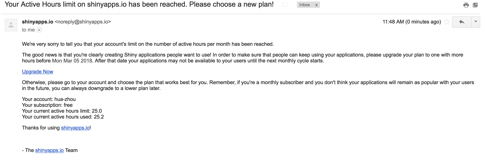

```{r setup, include=FALSE}
options(width = 160)
knitr::opts_chunk$set(echo = TRUE)
```

## What is Docker

- It took us considerable efforts to set up a GCP Compute Engine instance with a full stack of tools we need: CentOS, Linux libraries, R, R Studio, tidyverse, Shiny server, ...

- We can save the configuration as an image (or snapshot) so we don't have to re-configure each time using GCP. 

- In a more complex (buisiness) environment, different apps may have different or conflicting dependencies, making configuration and deployment an excessive overhead. 

- Alternative approach: each app, together with its computing enrivonment and database, can be **containerized**.

- **Paradigm**: develop apps locally (with potentially different toolchain), deploy (at scale) anywhere.

<p align="center">
{width=300px}
</p>

## Why do _we_ care?

Scenario 1: You have a Windows machine, but want to learn the open source toolchains on Linux.

Scenario 2: Your paper gets rejected, because the reviewer wants comparison with an existing method. And software for existing method only runs on Linux. 

Scenario 3: You made a fancy Shiny app. You want to deploy in AWS or GCP and scale that up to potentially many users.

<p align="center">
{width=700px}
</p>

Scenario 4: You develop a piece of software. You want to debug/test on different versions of R, on different OS (MacOS, Linux, Windows).

## Tutorial

We will follow the tutorial [Get started with Docker](https://docs.docker.com/get-started/) to:

- containerize a Python web app.

- run the container locally.

- run the container as a service locally.

- deploy the service to cloud.


```{bash, echo = FALSE, include = FALSE, error = TRUE}
# remove: all stopped containers, all networks not used by at least one container, all images without at least one container associated to them, all build cache
docker system prune -a -f
```

### Installation

[Download](https://docs.docker.com/install/) and install the Docker CE (Community Edition) on your computer.

### Docker survival commands

Part 1:
```{bash, eval = FALSE}
## List Docker CLI commands
docker
docker container --help

## Display Docker version and info
docker --version
docker version
docker info

## Excecute Docker image
docker run hello-world

## List Docker images
docker image ls

## List Docker containers (running, all, all in quiet mode)
docker container ls
docker container ls --all
docker container ls -a -q
```

Part 2:
```{bash, eval = FALSE}
docker build -t friendlyhello .  # Create image using this directory's Dockerfile
docker run -p 4000:80 friendlyhello  # Run "friendlyname" mapping port 4000 to 80
docker run -d -p 4000:80 friendlyhello         # Same thing, but in detached mode
docker container ls                                # List all running containers
docker container ls -a             # List all containers, even those not running
docker container stop <hash>           # Gracefully stop the specified container
docker container kill <hash>         # Force shutdown of the specified container
docker container rm <hash>        # Remove specified container from this machine
docker container rm $(docker container ls -a -q)         # Remove all containers
docker image ls -a                             # List all images on this machine
docker image rm <image id>            # Remove specified image from this machine
docker image rm $(docker image ls -a -q)   # Remove all images from this machine
docker login             # Log in this CLI session using your Docker credentials
docker tag <image> username/repository:tag  # Tag <image> for upload to registry
docker push username/repository:tag            # Upload tagged image to registry
docker run username/repository:tag                   # Run image from a registry
```

Part 3:
```{bash, eval = FALSE}
docker stack ls                                            # List stacks or apps
docker stack deploy -c <composefile> <appname>  # Run the specified Compose file
docker service ls                 # List running services associated with an app
docker service ps <service>                  # List tasks associated with an app
docker inspect <task or container>                   # Inspect task or container
docker container ls -q                                      # List container IDs
docker stack rm <appname>                             # Tear down an application
docker swarm leave --force      # Take down a single node swarm from the manager
```

### Containerize a web app

We use Docker to develop an app that servers a webpage.

#### Essential components

- `requirements.txt` lists the Python dependencies:
```{bash}
cat requirements.txt
```

- `app.py` is the Python code for serving webpage.
```{bash}
cat app.py
```

- `Dockerfile` instructs Docker how to put things together in a container:
```{bash}
cat Dockerfile
```
See [python on Docker Hub](https://hub.docker.com/_/python/) for details of the `python:2.7-slim` image.

#### Build the app

Build the image:
```{bash}
docker build -t friendlyhello .
```
Display the image:
```{bash}
docker image ls
```

#### Run the app

Run the app by
```{bash, eval = FALSE}
docker run -p 4000:80 friendlyhello
```
or in detached mode
```{bash, eval = TRUE}
docker run -d -p 4000:80 friendlyhello
```
`-p 4000:80` maps port 80 of the container to port 4000 of host.

Diplay the container:
```{bash}
docker container ls
```

We now should be able to check the webpage by pointing browser to `localhost:4000` or by
```{bash, eval = FALSE}
curl http://localhost:4000
```

To stop the container, issue:
```{bash, eval = FALSE}
docker container stop <CONTAINER_ID>
```
To kill all containers
```{bash, error = TRUE}
docker container kill $(docker container ls -a -q)
```
then remove them
```{bash, error = TRUE}
docker container rm $(docker container ls -a -q)
```

#### Share the image

Tag the `friendlyhello` image:
```{bash}
docker tag friendlyhello huazhou/get-started:part2
```
Upload the tagged image to registry:
```{bash, eval = FALSE}
docker push huazhou/get-started:part2
```
Run image from the registry:
```{bash, eval = FALSE}
docker run -d -p 4000:80 huazhou/get-started:part2
```

### Run multiple containers as service

Services are really just "containers in production." A service only runs one image, but it codifies the way that image runs—what ports it should use, how many replicas of the container should run so the service has the capacity it needs, and so on. 

`docker-compose.yml` specifies:

- Pull the image `hwachou/get-started:part2`.

- Run 5 instances of that image as a service called `web`, limiting each one to use, at most, 10% of the CPU (across all cores), and 50MB of RAM.

- Immediately restart containers if one fails.

- Map port 80 on the host to `web`’s port 80.

- Instruct `web`’s containers to share port 80 via a load-balanced network called webnet. (Internally, the containers themselves publish to `web`’s port 80 at an ephemeral port.)

- Define the `webnet` network with the default settings (which is a load-balanced overlay network).

```{bash}
cat docker-compose.yml
```

#### Run a new load-balanced app

```{bash}
docker swarm init
docker stack deploy -c docker-compose.yml getstartedlab
```

List the service:
```{bash}
docker service ls
```
List the tasks for your service:
```{bash}
docker service ps getstartedlab_web
```

To take down the service and swarm:
```{bash}
docker stack rm getstartedlab
docker swarm leave --force
```

#### Deploy to GCP

Option 1: Create a container-optimized instance in GCP Compute Engine.

Option 2: On any GCP instance, install Docker and run a container. 

- On CentOS, install Docker CE by:
```{bash, eval = FALSE}
# install yum-config-manager
sudo yum install -y yum-utils 
sudo yum install -y yum-config-manager device-mapper-persistent-data lvm2
# add Docker CE repo for CentOS
sudo yum-config-manager --add-repo https://download.docker.com/linux/centos/docker-ce.repo
## install Docker CE
sudo yum install docker-ce
```

- Run container:
```{bash, eval = FALSE}
sudo docker run -d -p 80:80 huazhou/get-started:part2
```

- To run the swarm, copy `docker-compose.yml` to the server and 
```{bash, eval = FALSE}
docker swarm init
docker stack deploy -c docker-compose.yml getstartedlab
```

### Multi-container, multi-machine applications

See [part 4](https://docs.docker.com/get-started/part4/) of the tutorial.

### Stack: heterogenous containers, multi-machine applications

See [part 5](https://docs.docker.com/get-started/part5/) of the tutorial.

### Deploy stack to cloud

See [part 6](https://docs.docker.com/get-started/part6/) of the tutorial.

## Scenario: Run a Linux container interactively

Run [CentOS](https://hub.docker.com/_/centos/) interactively (as `root`):
```{bash, eval = FALSE}
docker run -ti --rm centos:latest
```
Run [Ubuntu](https://hub.docker.com/_/ubuntu/) interactively (as `root`):
```{bash, eval = FALSE}
docker run -ti --rm ubuntu:latest
```

## Scenario: Run Linux+R on your MacOS/Windows laptop

- Launch R interactively:
```{bash, eval = FALSE}
docker run -ti --rm -v ~/Desktop:/Desktop r-base
```
It downloads, builds, and runs an image called [`r-base`](https://hub.docker.com/r/_/r-base/) (Debian + R).

- Run a bash session on the container:
```{bash, eval = FALSE}
docker run -ti --rm r-base /usr/bin/bash
```

- Run R in batch mode. Suppose current folder contains an R script `autoSim.R`, which we want to run:
```{bash, eval = FALSE}
docker run -ti --rm -v "$PWD":/home/docker -w /home/docker -u docker r-base Rscript autoSim.R
```

## Scenario: Deploy a Shiny app to cloud

Suppose we have a Shiny app `census-app` with contents: `app.R`, `data/counties.rds`, and `helpers.R`. It has dependencies `maps` and `mapproj` R packages. We want to deploy the Shiny app to a GCP instance. We can use following Dockerfile to compile an image
```{bash, echo = FALSE, eval = TRUE}
cat ../10-shiny/census-app/Dockerfile
```
and then deploy to cloud.

## Scenario: CentOS + R + RStudio + tidyverse toolchain

To build an image with CentOS + R + RStudio + tidyverse toolchain, we can use a Dockerfile.