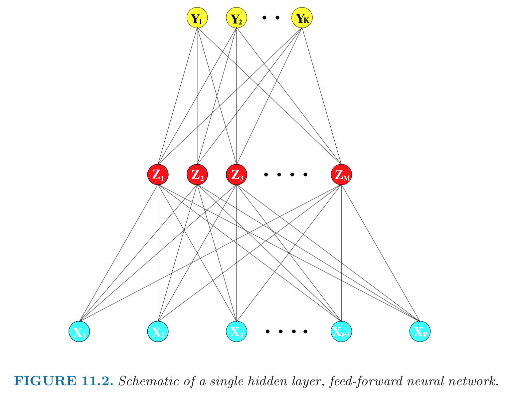
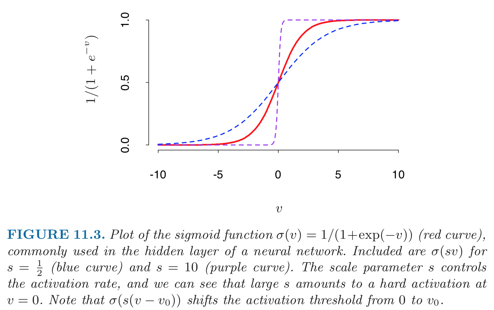
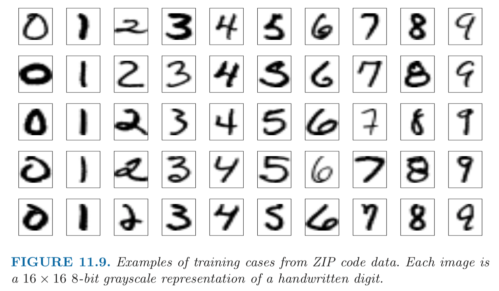
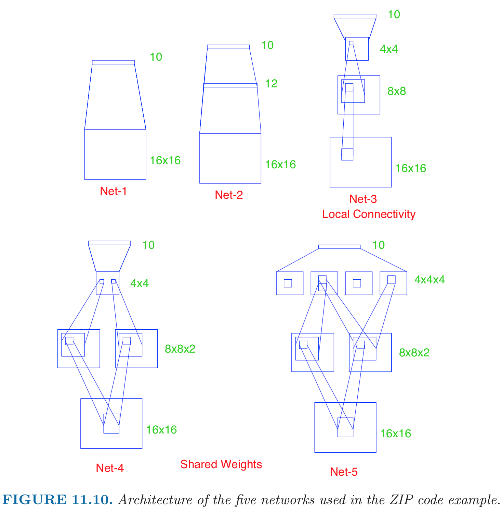

```{r setup, include=FALSE}
options(width = 160)
knitr::opts_chunk$set(echo = TRUE)
```

## Data scientist

<p align="center">
{width=500px}
</p>

In the last two lecturs, we discuss a general model for learning, neural networks.

## 

- Google brain:

- 

## Learning sources

- _Elements of Statistical Learning_ (ESL) Chapter 11: <https://web.stanford.edu/~hastie/ElemStatLearn/>.

- UFLDL: <http://ufldl.stanford.edu/tutorial/>.

## Single layer perceptron 

- Aka single hidden layer back-propagation network.

- Sum of nonlinear functions of linear combinations of the inputs, typically represented by a **network diagram**.

<p align="center">
{width=500px}
</p>

- Mathematical model:
\begin{eqnarray*}
Z_m &=& \sigma(\alpha_{0m} + \alpha_m^T X), \quad m = 1, \ldots, M \\
T_k &=& \beta_{0k} + \beta_k^T Z, \quad k = 1,\ldots, K \\
f_k(X) &=& g_k(T), \quad k = 1, \ldots, K.
\end{eqnarray*}  

    - **Output layer**: $Y=(Y_1, \ldots, Y_K)$ are $K$-dimensional output. E.g., for univariate response, $K=1$; for $K$-class classification, $k$-th unit models the probability of class $k$.  
    
    - **Input layer**: $X=(X_1, \ldots, X_p)$ are $p$-dimensional input features. 
    
    - **Hidden layer**: $Z=(Z_1, \ldots, Z_M)$ are **derived features** created from linear combinations of inputs $X$.
    
    - $T=(T_1, \ldots, T_K)$ are the output features that are directly associated with the outputs $Y$ through output functions $g_k(\cdot)$.
    
    - $g_k(T) = T$ for regression. $g_k(T) = e^{T_k} / \sum_{k=1}^K e^{T_k}$ for $K$-class classification.
    
- Activation function $\sigma$:  
<p align="center">
{width=500px}
</p>

    - Usually the **sigmoid** function
    $$
    \sigma(v) = \frac{1}{1 + e^{-v}}.
    $$
    
    - $\sigma(v)=$ a step function: human brain models where each unit represents a neuron, and the connections represent synapses; the neurons fired when the total signal passed to that unit exceeded a certain threshold.
    
- Loss function $L$

    - SSE:
    $$
      L = \sum_{k=1}^K \sum_{i=1}^n [y_{ik} - f_k(x_i)]^2.
    $$
    
    - Cross-entropy (deviance)
    $$
      L = - \sum_{k=1}^K \sum_{i=1}^n y_{ik} \log f_k(x_i).
    $$
    
- Model fitting: **back propagation** (gradient descent)

    - Let
    \begin{eqnarray*}
    z_{mi} &=& \sigma(\alpha_{0m} + \alpha_m^T x_i) \\
    R_i &=& \sum_{k=1}^K [y_{ik} - f_k(x_i)]^2.
    \end{eqnarray*}
    
    - The derivatives:
    \begin{eqnarray*}
      \frac{\partial R_i}{\partial \beta_{km}} &=& -2 [y_{ik} - f_k(x_i)] g_k'(\beta_k^T z_i) z_{mi} \equiv \delta_{ki} z_{mi} \\
      \frac{\partial R_i}{\alpha_{mi}} &=& - \sum_{i=1}^K 2[y_{ik} - f_k(x_i)] g_k'(\beta_k^T z_i) \beta_{km} \sigma'(\alpha_m^T x_i) x_{il} \equiv s_{mi} x_{il}.
    \end{eqnarray*}
    
    - Gradient descent update:
    \begin{eqnarray*}
      \beta_{km}^{(r+1)} &=& \beta_{km}^{(r)} - \gamma_r \sum_{i=1}^n \frac{\partial R_i}{\partial \beta_{km}} \\
      \alpha_{ml}^{(r+1)} &=& \alpha_{ml}^{(r)} - \gamma_r \sum_{i=1}^n \frac{\partial R_i}{\partial \alpha_{ml}}.
    \end{eqnarray*}
    
    - Back propagation equations
    $$
      s_{mi} = \sigma'(\alpha_m^T x_i) \sum_{k=1}^K \beta_{km} \delta_{ki}.
    $$
    
    - Two-pass updates: initialization $\to \hat f_k(x_i) \to \delta_{ki} \to s_{mi} \to \hat \beta_{km} \text{ and } \hat \alpha_{ml}$.
    
    - $\gamma_r$ is the learning rate.
    
    - Advantages: simple and local nature; each hidden units passes and receives information only to and from units that share a connection; can be implemented efficiently on a parallel architecture computer.
    
- Alternative fitting methods: conjugate gradients, variable metric methods.

## Multi-layer neural network

- 1 hidden layer:  
<p align="center">
{width=500px}
</p>

- 2 hidden layers:  
<p align="center">
{width=500px}
</p>

## Practical issues

- Starting values: usually starting values for weights are chosen to be random values near zero; hence the model starts out nearly linear, and becomes nonlinear as the weights increase.
    
- Overfitting: early stopping; weight decay by $L_2$ penalty  
    $$
    \frac{\lambda}{2} (\sum_{k, m} \beta_{km}^2 + \sum_{m, l} \alpha_{ml}^2).
    $$
    $\lambda$ is the **weight decay parameter**.
    
- Scaling of inputs: mean 0 and standard deviation 1.
    
- How many hidden units and how many hidden layers: guided by domain knowledge and experimentation.
    
- Multiple minima: try with different starting values.
    
- Neural network model is a **projectin pursuit** type additive model: 
$$
f(X) = \beta_0 + \sum_{m=1}^M \beta_m \sigma(\alpha_{m0} + \alpha_M^T X).
$$

- Neural networks are **not a fully automatic tool**, as they are sometimes advertised; as with all statistical models, subject matter knowledge should and often be used to improve their performance.

## Convoluted neural networks (CNN)

- **Fully connected networks** don't scale well with dimension of input images. E.g. $96 \times 96$ images have about $10^4$ input units, and assuming you want to learn 100 features, you have about $10^6$ parameters to learn.

- In **locally connected networks**, each hidden unit only connects to a small contiguous region of pixels in the input, e.g., a patch of image or a time span of the input audio.

- 

## Example: handwritten digit recognition. 

<p align="center">
{width=500px}
</p>

- Input: 256 pixel values from $16 \times 16$ grayscale images. Output: 0, 1, ..., 9 10 class-classification.
    
- A modest experiment subset: 320 training digits and 160 testing digits.
    
- net-1: no hidden layer, equivalent to multinomial logistic regression.  
net-2: one hidden layer, 12 hidden units fully connected.  
net-3: two hidden layers locally connected.  
net-4: two hidden layers, locally connected with weight sharing.  
net-5: two hidden layers, locally connected, two levels of weight sharing (was the result of many person years of experimentation).   
<p align="center">
{width=500px}
</p>    

    - Results:  

| network | links | weights | accuracy |
|---------|-------|---------|----------|
| net 1   | 2570  | 2570    | 80.0%    |
| net 2   | 3124  | 3214    | 87.0%    |
| net 3   | 1226  | 1226    | 88.5%    |
| net 4   | 2266  | 1131    | 94.0%    |
| net 5   | 5194  | 1060    | 98.4%    |

## Recurrent neural networks (RNN)

<https://colah.github.io/posts/2015-08-Understanding-LSTMs/>