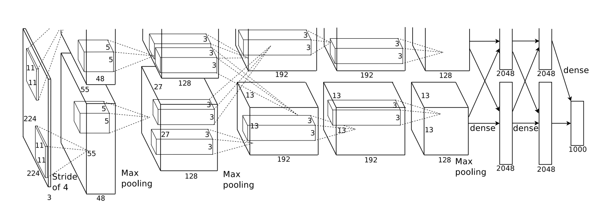

```{r setup, include=FALSE}
options(width = 160)
knitr::opts_chunk$set(echo = TRUE)
```

## Data scientist

<p align="center">
{width=500px}
</p>

In the last two lecturs, we discuss a general model for learning, neural networks.

## History and recent hype

- Google brain:

- 

## Learning sources

- _Elements of Statistical Learning_ (ESL) Chapter 11: <https://web.stanford.edu/~hastie/ElemStatLearn/>.

- UFLDL: <http://ufldl.stanford.edu/tutorial/>.

## Single layer neural network 

- Aka, Single layer perceptron, single hidden layer back-propagation network.

- Sum of nonlinear functions of linear combinations of the inputs, typically represented by a **network diagram**.

<p align="center">
{width=500px}
</p>

- Mathematical model:
\begin{eqnarray*}
Z_m &=& \sigma(\alpha_{0m} + \alpha_m^T X), \quad m = 1, \ldots, M \\
T_k &=& \beta_{0k} + \beta_k^T Z, \quad k = 1,\ldots, K \\
Y_k &=& f_k(X) = g_k(T), \quad k = 1, \ldots, K.
\end{eqnarray*}  

    - **Output layer**: $Y=(Y_1, \ldots, Y_K)$ are $K$-dimensional output. E.g., for univariate response, $K=1$; for $K$-class classification, $k$-th unit models the probability of class $k$.  
    
    - **Input layer**: $X=(X_1, \ldots, X_p)$ are $p$-dimensional input features. 
    
    - **Hidden layer**: $Z=(Z_1, \ldots, Z_M)$ are derived features created from linear combinations of inputs $X$.
    
    - $T=(T_1, \ldots, T_K)$ are the output features that are directly associated with the outputs $Y$ through output functions $g_k(\cdot)$.
    
    - $g_k(T) = T$ for regression. $g_k(T) = e^{T_k} / \sum_{k=1}^K e^{T_k}$ for $K$-class classification.
    
    - Number of **weights** (parameters) is $M(p+1) + K(M+1)$.
    
- Activation function $\sigma$:  
<p align="center">
{width=500px}
</p>

    - **sigmoid** function:
    $$
    \sigma(v) = \frac{1}{1 + e^{-v}}.
    $$
    
    - $\sigma(v)=$ a step function: human brain models where each unit represents a neuron, and the connections represent synapses; the neurons fired when the total signal passed to that unit exceeded a certain threshold.
    
    - **Rectifier**. $\sigma(v) = v_+ = max(0, v)$. A unit employing the rectifier is called a **rectified linear unit (ReLU)**. According to Wikipedia:  
> The rectifier is, as of 2018, the most popular activation function for deep neural networks.    
    
    - **Softplus**. $\sigma(v) = \log (1 + \exp v)$.
<p align="center">
{width=500px}
</p>
    
- Given training data $(X_1, Y_1), \ldots, (X_n, Y_n)$, the loss function $L$ can be:

    - SSE:
    $$
      L = \sum_{k=1}^K \sum_{i=1}^n [y_{ik} - f_k(x_i)]^2.
    $$
    
    - Cross-entropy (deviance)
    $$
      L = - \sum_{k=1}^K \sum_{i=1}^n y_{ik} \log f_k(x_i).
    $$
    
- Model fitting: **back propagation** (gradient descent)

    - Let
    \begin{eqnarray*}
    z_{mi} &=& \sigma(\alpha_{0m} + \alpha_m^T x_i) \\
    R_i &=& \sum_{k=1}^K [y_{ik} - f_k(x_i)]^2.
    \end{eqnarray*}
    
    - The derivatives:
    \begin{eqnarray*}
      \frac{\partial R_i}{\partial \beta_{km}} &=& -2 [y_{ik} - f_k(x_i)] g_k'(\beta_k^T z_i) z_{mi} \equiv \delta_{ki} z_{mi} \\
      \frac{\partial R_i}{\alpha_{mi}} &=& - \sum_{i=1}^K 2[y_{ik} - f_k(x_i)] g_k'(\beta_k^T z_i) \beta_{km} \sigma'(\alpha_m^T x_i) x_{il} \equiv s_{mi} x_{il}.
    \end{eqnarray*}
    
    - Gradient descent update:
    \begin{eqnarray*}
      \beta_{km}^{(r+1)} &=& \beta_{km}^{(r)} - \gamma_r \sum_{i=1}^n \frac{\partial R_i}{\partial \beta_{km}} \\
      \alpha_{ml}^{(r+1)} &=& \alpha_{ml}^{(r)} - \gamma_r \sum_{i=1}^n \frac{\partial R_i}{\partial \alpha_{ml}}.
    \end{eqnarray*}
    
    - Back propagation equations
    $$
      s_{mi} = \sigma'(\alpha_m^T x_i) \sum_{k=1}^K \beta_{km} \delta_{ki}.
    $$
    
    - Two-pass updates: initialization $\to \hat f_k(x_i) \to \delta_{ki} \to s_{mi} \to \hat \beta_{km} \text{ and } \hat \alpha_{ml}$.
    
    - $\gamma_r$ is the learning rate.
    
    - Advantages: simple and local nature; each hidden units passes and receives information only to and from units that share a connection; can be implemented efficiently on a parallel architecture computer.
    
- Alternative fitting methods: conjugate gradients, variable metric methods.

## Multi-layer neural network

- Aka multi-layer perceptron (MLP).

- 1 hidden layer:  
<p align="center">
{width=500px}
</p>

- 2 hidden layers:  
<p align="center">
{width=500px}
</p>

## Practical issues

- Starting values: usually starting values for weights are chosen to be random values near zero; hence the model starts out nearly linear, and becomes nonlinear as the weights increase.
    
- Overfitting: early stopping; weight decay by $L_2$ penalty  
    $$
    \frac{\lambda}{2} (\sum_{k, m} \beta_{km}^2 + \sum_{m, l} \alpha_{ml}^2).
    $$
    $\lambda$ is the **weight decay parameter**.
    
- Scaling of inputs: mean 0 and standard deviation 1.
    
- How many hidden units and how many hidden layers: guided by domain knowledge and experimentation.
    
- Multiple minima: try with different starting values.
    
- Neural network model is a **projectin pursuit** type additive model: 
$$
f(X) = \beta_0 + \sum_{m=1}^M \beta_m \sigma(\alpha_{m0} + \alpha_M^T X).
$$

- Neural networks are **not a fully automatic tool**, as they are sometimes advertised; as with all statistical models, subject matter knowledge should and often be used to improve their performance.

## Convoluted neural networks (CNN)

Sources: <https://colah.github.io/posts/2014-07-Conv-Nets-Modular/>

- **Fully connected networks** don't scale well with dimension of input images. E.g. $96 \times 96$ images have about $10^4$ input units, and assuming you want to learn 100 features, you have about $10^6$ parameters to learn.

- In **locally connected networks**, each hidden unit only connects to a small contiguous region of pixels in the input, e.g., a patch of image or a time span of the input audio.

- **Convolutions**. Natural images have the property of being **stationary**, meaning that the statistics of one part of the image are the same as any other part. This suggests that the features that we learn at one part of the image can also be applied to other parts of the image, and we can use the same features at all locations.
<p align="center">
{width=500px}
</p>

    Consider $96 \times 96$ images. For each hidden unit, first learn a $8 \times 8$ **feature detector** from randomly sampled $8 \times 8$ patches from the larger image. Then apply the learned detector to the all $8 \times 8$ regions of the $96 \times 96$ image to obtain $89 \times 89$ convolved features for that hidden unit.

- **Pooling**. For a neural network with 100 hidden units, we have $89^2 * 100 = 792,100$ convoluted features. This can be reduced by calculating the mean (or max) vale of a particular feature over a region of the image. These summary statistics are much lower in dimension (compared to using all of the extracted features) and can also improve results (less over-fitting). We aggregation operation is called this operation ”‘pooling”’, or sometimes ”‘mean pooling”’ or ”‘max pooling”’ (depending on the pooling operation applied).
<p align="center">
{width=500px}
</p>

- **Convultional neural network (CNN)**. Convolution + pooling + multi-layer neural networks.
<p align="center">
<!-- {width=500px} -->
{width=500px}
{width=500px}
</p>

## Example: handwritten digit recognition. 

<p align="center">
{width=500px}
</p>

- Input: 256 pixel values from $16 \times 16$ grayscale images. Output: 0, 1, ..., 9 10 class-classification.
    
- A modest experiment subset: 320 training digits and 160 testing digits.
    
- net-1: no hidden layer, equivalent to multinomial logistic regression.  
net-2: one hidden layer, 12 hidden units fully connected.  
net-3: two hidden layers locally connected.  
net-4: two hidden layers, locally connected with weight sharing.  
net-5: two hidden layers, locally connected, two levels of weight sharing (was the result of many person years of experimentation).   
<p align="center">
{width=500px}
</p>    

    - Results:  

| network | links | weights | accuracy |
|---------|-------|---------|----------|
| net 1   | 2570  | 2570    | 80.0%    |
| net 2   | 3124  | 3214    | 87.0%    |
| net 3   | 1226  | 1226    | 88.5%    |
| net 4   | 2266  | 1131    | 94.0%    |
| net 5   | 5194  | 1060    | 98.4%    |

## Example: image classification

- [Krizhevsky, Sutskever, Hinton (2012)](http://www.cs.toronto.edu/~fritz/absps/imagenet.pdf)

- [ImageNet](http://www.image-net.org) dataset.

- Novel techniques: GPU, ReLU, DropOut.

- 5 convolutional layers, pooling interspersed, 3 fully connected layers.
<p align="center">
{width=500px}
</p>

- Achieved 63% accuracy:
<p align="center">
{width=500px}
</p>

## Recurrent neural networks (RNN)

Souces: <https://colah.github.io/posts/2015-08-Understanding-LSTMs/>
<http://karpathy.github.io/2015/05/21/rnn-effectiveness/>

- MLP and CNN accept a fixed-sized vector as input (e.g. an image) and produce a fixed-sized vector as output (e.g. probabilities of different classes). 

- Recurrent neural networks (RNN) allow us to operate over sequences of vectors: sequences in the input, the output, or in the most general case both.

- Applications: 

    - **NLP/Speech**: transcribe speech to text, machine translation, generate handwritten text, ...
    
    - **Computer vision**: image captioning, video captioning,  ...

- RNNs accept an input vector $x$ and give you an output vector $y$. However, crucially this output vector’s contents are influenced not only by the input you just fed in, but also on the entire history of inputs you’ve fed in in the past.

- Short-term dependencies: to predict the last word in "the clouds are in the _sky_":
<p align="center">
{width=500px}
</p>

- Long-term dependencies: to predict the last word in "I grew up in France... I speek fluent _French_":
<p align="center">
{width=500px}
</p>

- Typical RNNs are having trouble with learning long-term dependencies.
<p align="center">
{width=500px}
</p>

- **Long Short Term Memory networks (LSTM)** are a special kind of RNN capable of learning long-term dependencies. 
<p align="center">
{width=500px}
{width=500px}
</p>

    The **cell state** allows information to just flow along it unchanged.
    <p align="center">
    {width=500px}
    </p>
    The **gates** give the ability to remove or add information to the cell state.
    <p align="center">
    {width=100px}
    </p>