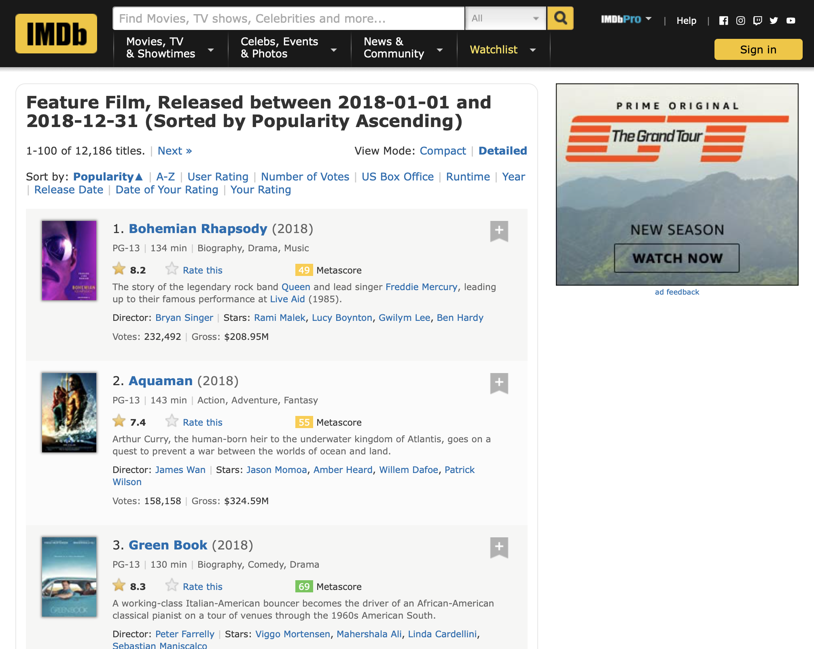
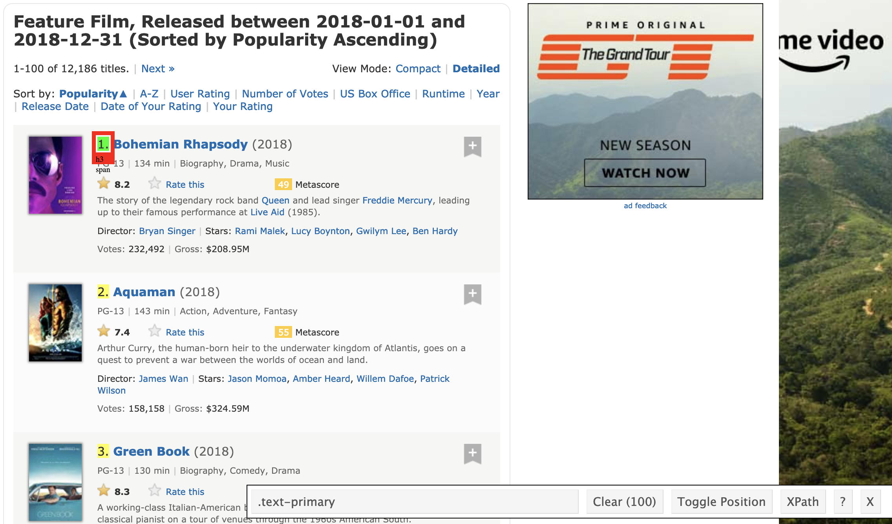

## Web scraping

There is a wealth of data on internet. How to scrape them and analyze them?

## rvest

[rvest](https://github.com/hadley/rvest) is an R package written by Hadley Wickham which makes web scraping easy.

## Scraping from webpage

- We follow instructions in a [Blog by SAURAV KAUSHIK](https://www.analyticsvidhya.com/blog/2017/03/beginners-guide-on-web-scraping-in-r-using-rvest-with-hands-on-knowledge/) to find the most popular feature films of 2018.

- Install the [SelectorGadget](https://selectorgadget.com/) extension for Chrome.

- The 100 most popular feature films released in 2018 can be accessed at page <https://www.imdb.com/search/title?count=100&release_date=2018,2018&title_type=feature>.

    ```{r}
    #Loading the rvest and tidyverse package
    library("rvest")
    library("tidyverse")
    #Specifying the url for desired website to be scraped
    url <- 'http://www.imdb.com/search/title?count=100&release_date=2018,2018&title_type=feature'
    #Reading the HTML code from the website
    (webpage <- read_html(url))
    ```

- We want to scrape following 11 features from this page:
    - Rank
    - Title
    - Description
    - Runtime
    - Genre
    - Rating
    - Metascore
    - Votes
    - Gross_Eerning_in_Mil
    - Director
    - Actor

<p align="center">
  
</p>

### Rank

- Use SelectorGadget to highlight the element we want to scrape

<p align="center">
  
</p>

- Use the CSS selector to get the rankings
    ```{r}
    # Use CSS selectors to scrap the rankings section
    (rank_data_html <- html_nodes(webpage, '.text-primary'))
    # Convert the ranking data to text
    (rank_data <- html_text(rank_data_html))
    # Turn into numerical values
    (rank_data <- as.integer(rank_data))
    ```

### Title

- Use SelectorGadget to find the CSS selector `.lister-item-header a`.
    ```{r}
    # Using CSS selectors to scrap the title section
    (title_data_html <- html_nodes(webpage, '.lister-item-header a'))
    # Converting the title data to text
    (title_data <- html_text(title_data_html))
    ```
    
### Description

-
    ```{r}
    # Using CSS selectors to scrap the description section
    (description_data_html <- html_nodes(webpage, '.ratings-bar+ .text-muted'))
    # Converting the description data to text
    description_data <- html_text(description_data_html)
    # take a look at first few
    head(description_data)
    # strip the '\n'
    description_data <- str_replace(description_data, "^\\n\\s+", "")
    head(description_data)
    ```

### Runtime

-
    ```{r}
    # Using CSS selectors to scrap the Movie runtime section
    runtime_data_html <- html_nodes(webpage, '.text-muted .runtime')
    # Converting the runtime data to text
    runtime_data <- html_text(runtime_data_html)
    # Let's have a look at the runtime
    head(runtime_data)
    # Data-Preprocessing: removing mins and converting it to numerical
    runtime_data <- str_replace(runtime_data, " min", "")
    runtime_data <- as.numeric(runtime_data)
    #Let's have another look at the runtime data
    head(runtime_data)
    ```

### Genre

-
    ```{r}
    # Using CSS selectors to scrap the Movie genre section
    genre_data_html <- html_nodes(webpage, '.genre')
    # Converting the genre data to text
    genre_data <- html_text(genre_data_html)
    # Let's have a look at the genre data
    head(genre_data)    
    # Data-Preprocessing: retrieve the first word
    genre_data <- str_extract(genre_data, "[:alpha:]+")
    # Convering each genre from text to factor
    #genre_data <- as.factor(genre_data)
    # Let's have another look at the genre data
    head(genre_data)
    ```

### Rating

-
    ```{r}
    # Using CSS selectors to scrap the IMDB rating section
    rating_data_html <- html_nodes(webpage, '.ratings-imdb-rating strong')
    # Converting the ratings data to text
    rating_data <- html_text(rating_data_html)
    # Let's have a look at the ratings
    head(rating_data)
    # Data-Preprocessing: converting ratings to numerical
    rating_data <- as.numeric(rating_data)
    # Let's have another look at the ratings data
    rating_data
    ```
    
### Votes

-
    ```{r}
    # Using CSS selectors to scrap the votes section
    votes_data_html <- html_nodes(webpage, '.sort-num_votes-visible span:nth-child(2)')
    # Converting the votes data to text
    votes_data <- html_text(votes_data_html)
    # Let's have a look at the votes data
    head(votes_data)
    # Data-Preprocessing: removing commas
    votes_data <- str_replace(votes_data, ",", "")
    # Data-Preprocessing: converting votes to numerical
    votes_data <- as.numeric(votes_data)
    #Let's have another look at the votes data
    votes_data
    ```

### Director

-
    ```{r}
    # Using CSS selectors to scrap the directors section
    (directors_data_html <- html_nodes(webpage,'.text-muted+ p a:nth-child(1)'))
    # Converting the directors data to text
    directors_data <- html_text(directors_data_html)
    # Let's have a look at the directors data
    head(directors_data)
    # Data-Preprocessing: converting directors data into factors
    (directors_data <- as.factor(directors_data))
    ```

### Actor

-
    ```{r}
    # Using CSS selectors to scrap the actors section
    (actors_data_html <- html_nodes(webpage, '.lister-item-content .ghost+ a'))
    # Converting the gross actors data to text
    actors_data <- html_text(actors_data_html)
    # Let's have a look at the actors data
    head(actors_data)
    # Data-Preprocessing: converting actors data into factors
    (actors_data <- as.factor(actors_data))
    ```

### Metascore

- Be careful with missing data.
    ```{r}
    # Using CSS selectors to scrap the metascore section
    metascore_data_html <- html_nodes(webpage, '.metascore')
    # Converting the runtime data to text
    metascore_data <- html_text(metascore_data_html)
    # Let's have a look at the metascore 
    head(metascore_data)
    # Data-Preprocessing: removing extra space in metascore
    metascore_data <- str_replace(metascore_data, "\\s*$", "")
    metascore_data <- as.numeric(metascore_data)
    metascore_data
    # Lets check the length of metascore data
    length(metascore_data)
    # Visual inspection finds 69, 74, 87 don't have metascore
    ms <- rep(NA, 100)
    ms[-c(85, 93, 96)] <- metascore_data
    (metascore_data <- ms)
    ```
    
### Gross

- Be careful with missing data.
    ```{r}
    # Using CSS selectors to scrap the gross revenue section
    gross_data_html <- html_nodes(webpage,'.ghost~ .text-muted+ span')
    # Converting the gross revenue data to text
    gross_data <- html_text(gross_data_html)
    # Let's have a look at the votes data
    head(gross_data)
    # Data-Preprocessing: removing '$' and 'M' signs
    gross_data <- str_replace(gross_data, "M", "")
    gross_data <- str_sub(gross_data, 2, 10)
    #(gross_data <- str_extract(gross_data, "[:digit:]+.[:digit:]+"))
    gross_data <- as.numeric(gross_data)
    # Let's check the length of gross data
    length(gross_data)
    # Visual inspection finds below movies don't have gross
    gs_data <- rep(NA, 100)
    gs_data[-c(6, 12, 29, 40, 61, 69, 71, 74, 78, 82, 84:87, 90)] <- gross_data
    (gross_data <- gs_data)
    ```

## Missing entries

- Following code programatically figures out missing entries for metascore.
    ```{r}
    # Use CSS selectors to scrap the rankings section
    (rank_metascore_data_html <- html_nodes(webpage, '.unfavorable , .favorable , .mixed , .text-primary'))
    # Convert the ranking data to text
    (rank_metascore_data <- html_text(rank_metascore_data_html))
    # Strip spaces
    (rank_metascore_data <- str_replace(rank_metascore_data, "\\s+", ""))
    # a rank followed by another rank means the metascore for the 1st rank is missing
    (isrank <- str_detect(rank_metascore_data, "\\.$"))
    (ismissing <- isrank[1:length(rank_metascore_data)-1] & 
      isrank[2:length(rank_metascore_data)])
    (missingpos <- as.integer(rank_metascore_data[ismissing]))
    #(rank_metascore_data <- as.integer(rank_metascore_data))
    ```

- You (students) should work out the code for finding missing positions for gross.

## Visualizing movie data

- Form a tibble:
    ```{r}
    # Combining all the lists to form a data frame
    movies <- tibble(Rank = rank_data, Title = title_data,
                     Description = description_data, Runtime = runtime_data,
                     Genre = genre_data, Rating = rating_data,
                     Metascore = metascore_data, Votes = votes_data,
                     Gross_Earning_in_Mil = gross_data,
                     Director = directors_data, Actor = actors_data)
    movies %>% print(width=Inf)
    ```
    
- How many top 100 movies are in each genre?
    ```{r}
    ggplot(movies) +
      geom_bar(mapping = aes(x = Genre))
    ```

- Which genre is most profitable in terms of average gross earnings?
    ```{r}
    (earn_by_genre <- movies %>%
      group_by(Genre) %>%
      summarise(avg_earning = mean(Gross_Earning_in_Mil, na.rm=TRUE)))
    ggplot(data = earn_by_genre) +
      geom_col(mapping = aes(x = Genre, y = avg_earning)) + 
      labs(y = "avg earning in millions")
    ```
    ```{r}
    ggplot(data = movies) +
      geom_boxplot(mapping = aes(x = Genre, y = Gross_Earning_in_Mil)) + 
      labs(y = "Gross earning in millions")
    ```

- Is there a relationship between gross earning and rating? Find the best selling movie (by gross earning) in each genre    
    ```{r}
    library("ggrepel")
    (best_in_genre <- movies %>%
        group_by(Genre) %>%
        filter(row_number(desc(Gross_Earning_in_Mil)) == 1))
    ggplot(movies, mapping = aes(x = Rating, y = Gross_Earning_in_Mil)) +
      geom_point(mapping = aes(size = Votes, color = Genre)) + 
      ggrepel::geom_label_repel(aes(label = Title), data = best_in_genre) +
      labs(y = "Gross earning in millions")
    ```

## Scraping image data from Google

- Read blog <https://www.r-bloggers.com/how-to-scrape-images-from-google/>

- For example, to download first 10 images from search term "ucla":
    ```{r}
    source("scrapeGoogleImages.R")
    ### exchange the search terms here!
    (gg <- scrapeJSSite(searchTerm = "ucla"))
    downloadImages(as.character(gg$images), 1)
    ```

- Let's peek into the R code:
    ```{bash}
    cat scrapeGoogleImages.R
    ```
    It substitues the query term in the JavaScript, which then use `phantomjs` (a barebone, non-GUI browser) to scrape the webpage into `1.html`. Then download images in `1.html` to the `images` folder.
    ```{bash}
    ls images/
    ```

## Scraping finance data

- `quantmod` package contains many utility functions for retrieving and plotting finance data. E.g.,
    ```{r}
    library(quantmod)
    stock <- getSymbols("AAPL", src = "yahoo", auto.assign = FALSE)
    head(stock)
    chartSeries(stock, theme = chartTheme("white"),
                type = "line", log.scale = FALSE, TA = NULL)
    ```
