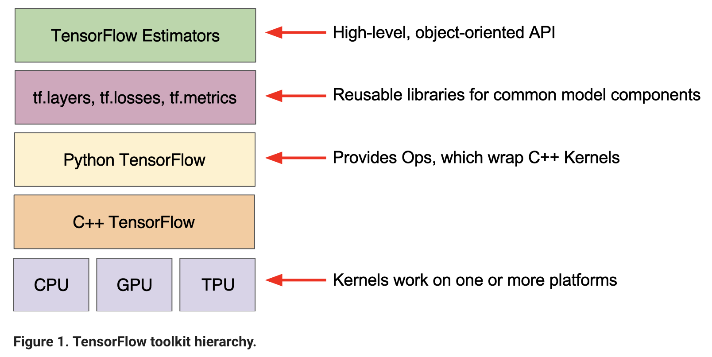

```{r setup, include=FALSE}
options(width = 120)
knitr::opts_chunk$set(echo = TRUE)
sessionInfo()
```

## Software

- High-level software focuses on user-friendly interface to specify and train models.  
[Keras](https://keras.io), [PyTorch](http://pytorch.org) (only Linux and MacOS), [scikit-learn](http://scikit-learn.org/stable/), ...

- Lower-level software focuses on developer tools for impelementing deep learning models.   
[TensorFlow](https://www.tensorflow.org), [Theano](http://deeplearning.net/software/theano/#), [CNTK](https://github.com/Microsoft/CNTK), [Caffe](http://caffe.berkeleyvision.org), [Torch](http://torch.ch), ...

- Most tools are developed in Python plus a low-level language.

## TensorFlow

- Developed by Google Brain team for internal Google use. Formerly DistBelief.

- Open sourced in Nov 2015.

- OS: Linux, MacOS, and Windows (since Nov 2016).

- GPU support: NVIDIA CUDA.

- TPU (tensor processing unit), built specifically for machine learning and tailored for TensorFlow.

- Mobile device deployment: TensorFlow Lite (May 2017) for Android and iOS.

<p align="center">
{width=600px}
</p>


- Used in a variety of Google apps: speech recognition (Google assistant), Gmail (Smart Reply), search, translate, self-driving car ...

> when you have a hammer, everything looks like a nail.  

<p align="center">
{width=200px}
</p>

- [Machine Learning Crash Course (MLCC)](https://developers.google.com/machine-learning/crash-course/?utm_source=google-ai&utm_medium=card-image&utm_campaign=training-hub&utm_content=ml-crash-course). A 15 hour workshop available to public since March 1, 2018.

## R/RStudio

R users can access Keras and TensorFlow via the `keras` and `tensorflow` packages. 

```{r, eval=FALSE}
#install.packages("keras")
library(keras)
install_keras()
# install_keras(tensorflow = "gpu") # if NVIDIA GPU is available
```

<!-- Questions: -->

<!-- - How much is CPU usage? Are all cores being used? -->

<!-- - Is training loss monotone? Is validation loss monotone? Is testing error monotone? -->

<!-- - What are epoches? Does loss always decrease with epoches? Does training error always decrease with epoches? -->

<!-- -  -->

## Example: MNIST - MLP

[Rmd](http://raw.githubusercontent.com/Hua-Zhou/Hua-Zhou.github.io/master/teaching/biostatm280-2019winter/slides/15-nn/mnist_mlp.Rmd), [html](./mnist_mlp.html).

## Example: MNIST - CNN

[Rmd](http://raw.githubusercontent.com/Hua-Zhou/Hua-Zhou.github.io/master/teaching/biostatm280-2019winter/slides/15-nn/mnist_cnn.Rmd), [html](./mnist_cnn.html).

<!-- ## Example: Generate text from Nietzsche’s writings -->

<!-- [Rmd](http://raw.githubusercontent.com/Hua-Zhou/Hua-Zhou.github.io/master/teaching/biostatm280-2019winter/slides/15-nn/nietzsche_lstm.Rmd), [html](./nietzsche_lstm.html). -->